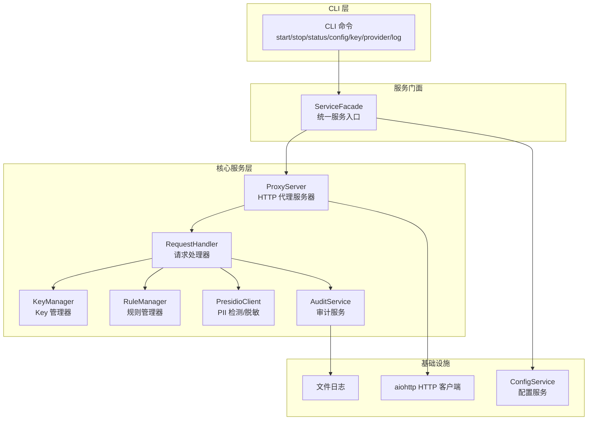
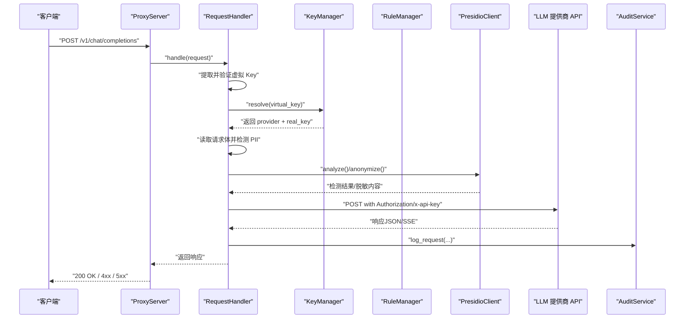
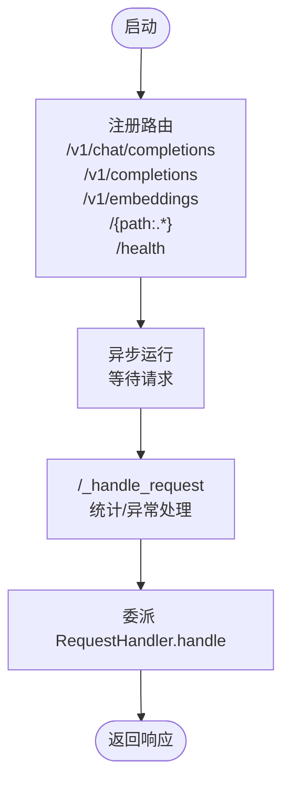
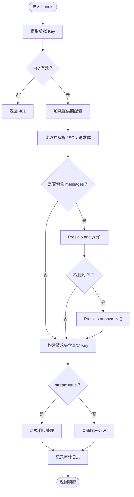
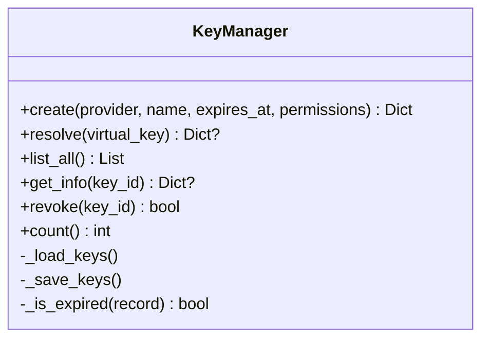
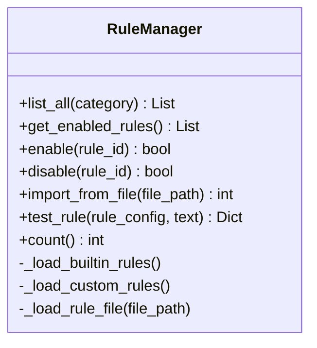
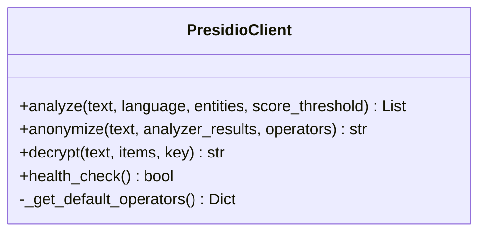
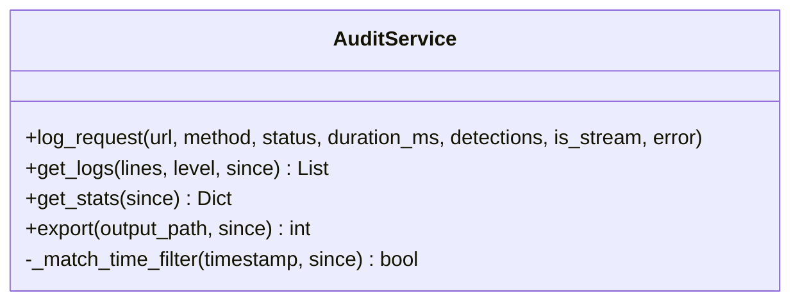
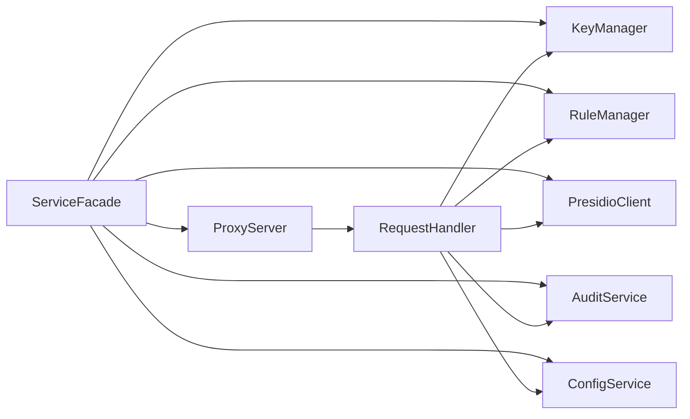

# HTTP代理服务

<cite>
**本文档引用的文件**
- [design-update-20260404-v1.0-init.md](file://doc/design/design-update-20260404-v1.0-init.md)
- [02_proxy_service.md](file://doc/test/tcs/v1.0/02_proxy_service.md)
- [01_cli_commands.md](file://doc/test/tcs/v1.0/01_cli_commands.md)
- [03_key_management.md](file://doc/test/tcs/v1.0/03_key_management.md)
- [07_configuration.md](file://doc/test/tcs/v1.0/07_configuration.md)
- [config_sample.yaml](file://doc/test/tcs/v1.0/test_data/config_sample.yaml)
- [providers_sample.yaml](file://doc/test/tcs/v1.0/test_data/providers_sample.yaml)
</cite>

## 目录
1. [简介](#简介)
2. [项目结构](#项目结构)
3. [核心组件](#核心组件)
4. [架构总览](#架构总览)
5. [详细组件分析](#详细组件分析)
6. [依赖关系分析](#依赖关系分析)
7. [性能考虑](#性能考虑)
8. [故障排查指南](#故障排查指南)
9. [结论](#结论)
10. [附录](#附录)

## 简介
本文件为 LLM Privacy Gateway 的 HTTP 代理服务技术文档，聚焦于本地 HTTP 代理服务器的设计与实现，涵盖请求接收、处理流程、响应转发机制、OpenAI API 兼容性、Key 路由与规则配置、异步处理与并发控制、错误处理策略、API 参考、部署配置与性能调优等内容。文档基于仓库中的设计文档与测试用例，确保内容可追溯至实际源码与测试场景。

## 项目结构
- 设计文档集中描述了代理服务的整体架构、模块职责、数据流与配置系统。
- 测试用例文档提供了代理服务的黑盒测试场景，覆盖启动/停止、请求转发、流式响应、错误处理、并发与健康检查等关键能力。
- 配置样例展示了代理、提供商、日志、审计等配置项的结构与默认值。

图表来源
- [design-update-20260404-v1.0-init.md:70-122](file://doc/design/design-update-20260404-v1.0-init.md#L70-L122)
- [design-update-20260404-v1.0-init.md:411-568](file://doc/design/design-update-20260404-v1.0-init.md#L411-L568)

章节来源
- [design-update-20260404-v1.0-init.md:70-122](file://doc/design/design-update-20260404-v1.0-init.md#L70-L122)
- [design-update-20260404-v1.0-init.md:411-568](file://doc/design/design-update-20260404-v1.0-init.md#L411-L568)

## 核心组件
- 代理服务器（ProxyServer）：基于 aiohttp 的异步 HTTP 服务器，负责路由注册、请求生命周期管理与统计。
- 请求处理器（RequestHandler）：实现 OpenAI API 兼容的请求解析、虚拟 Key 验证、PII 检测与脱敏、目标提供商路由与转发、流式响应处理与审计日志记录。
- Key 管理器（KeyManager）：虚拟 Key 生成、映射、解析、吊销与过期校验。
- 规则管理器（RuleManager）：内置与自定义规则加载、启用/禁用、导入与测试。
- Presidio 客户端（PresidioClient）：与 Presidio 服务交互，提供 PII 检测与脱敏能力。
- 审计服务（AuditService）：记录请求处理日志、统计与导出。
- 配置服务（ConfigService）：配置加载、优先级合并与持久化。

章节来源
- [design-update-20260404-v1.0-init.md:570-741](file://doc/design/design-update-20260404-v1.0-init.md#L570-L741)
- [design-update-20260404-v1.0-init.md:743-944](file://doc/design/design-update-20260404-v1.0-init.md#L743-L944)
- [design-update-20260404-v1.0-init.md:1115-1275](file://doc/design/design-update-20260404-v1.0-init.md#L1115-L1275)
- [design-update-20260404-v1.0-init.md:1277-1439](file://doc/design/design-update-20260404-v1.0-init.md#L1277-L1439)
- [design-update-20260404-v1.0-init.md:946-1113](file://doc/design/design-update-20260404-v1.0-init.md#L946-L1113)
- [design-update-20260404-v1.0-init.md:1441-1640](file://doc/design/design-update-20260404-v1.0-init.md#L1441-L1640)

## 架构总览
代理服务采用“服务门面 + 核心服务”的分层设计，CLI 通过门面访问代理、Key、规则、审计与 Presidio 等服务；代理服务器负责接收请求，委托处理器完成鉴权、PII 处理、路由与转发，并记录审计日志。

图表来源
- [design-update-20260404-v1.0-init.md:743-944](file://doc/design/design-update-20260404-v1.0-init.md#L743-L944)
- [design-update-20260404-v1.0-init.md:570-741](file://doc/design/design-update-20260404-v1.0-init.md#L570-L741)

## 详细组件分析

### 代理服务器（ProxyServer）
- 职责：监听本地端口、注册路由、委派请求处理、生命周期管理与统计。
- 路由：注册 /v1/chat/completions、/v1/completions、/v1/embeddings 以及通用 /{path:.*} 路由；提供 /health 健康检查。
- 异步：基于 aiohttp 的异步启动与停止，支持守护进程模式。
- 统计：维护总请求数、成功/失败数、平均延迟与 PII 检测数等指标。

图表来源
- [design-update-20260404-v1.0-init.md:698-741](file://doc/design/design-update-20260404-v1.0-init.md#L698-L741)

章节来源
- [design-update-20260404-v1.0-init.md:570-741](file://doc/design/design-update-20260404-v1.0-init.md#L570-L741)

### 请求处理器（RequestHandler）
- 职责：虚拟 Key 验证、消息提取与 PII 检测/脱敏、目标 URL 构建、请求头组装、转发与响应处理（含流式）、审计日志记录。
- OpenAI 兼容：支持 /v1/chat/completions、/v1/completions、/v1/embeddings 端点；对 stream 参数进行流式处理。
- Key 路由：根据 Key 映射获取真实提供商与真实 Key，按提供商类型设置 Authorization/x-api-key。
- Presidio 集成：按需检测并脱敏消息内容，支持默认与自定义脱敏策略。

图表来源
- [design-update-20260404-v1.0-init.md:743-944](file://doc/design/design-update-20260404-v1.0-init.md#L743-L944)

章节来源
- [design-update-20260404-v1.0-init.md:743-944](file://doc/design/design-update-20260404-v1.0-init.md#L743-L944)

### Key 管理器（KeyManager）
- 职责：生成虚拟 Key、映射虚拟 Key 与真实 Key、生命周期管理（过期、使用统计）、吊销与查询。
- Key 格式：前缀 sk-virtual-，内部使用哈希 ID；支持过期时间与权限配置。
- 解析流程：遍历已加载 Key，匹配 virtual_key，校验过期，读取真实 Key 并更新使用统计。

图表来源
- [design-update-20260404-v1.0-init.md:1115-1275](file://doc/design/design-update-20260404-v1.0-init.md#L1115-L1275)

章节来源
- [design-update-20260404-v1.0-init.md:1115-1275](file://doc/design/design-update-20260404-v1.0-init.md#L1115-L1275)

### 规则管理器（RuleManager）
- 职责：加载内置与自定义规则、启用/禁用、导入、测试与统计。
- 规则类型：正则与关键词两类；支持分类与来源标注。

图表来源
- [design-update-20260404-v1.0-init.md:1277-1439](file://doc/design/design-update-20260404-v1.0-init.md#L1277-L1439)

章节来源
- [design-update-20260404-v1.0-init.md:1277-1439](file://doc/design/design-update-20260404-v1.0-init.md#L1277-L1439)

### Presidio 客户端（PresidioClient）
- 职责：调用 Presidio Analyzer/Anonymizer/Decrypt，管理连接与健康检查。
- 默认脱敏策略：针对常见实体类型提供默认掩码/替换策略，支持自定义覆盖。

图表来源
- [design-update-20260404-v1.0-init.md:946-1113](file://doc/design/design-update-20260404-v1.0-init.md#L946-L1113)

章节来源
- [design-update-20260404-v1.0-init.md:946-1113](file://doc/design/design-update-20260404-v1.0-init.md#L946-L1113)

### 审计服务（AuditService）
- 职责：记录请求处理日志（JSON Lines）、查询统计、导出与清理。
- 日志字段：时间戳、URL、方法、状态码、耗时、检测结果、PII 数量、是否流式、错误信息等。

图表来源
- [design-update-20260404-v1.0-init.md:1441-1640](file://doc/design/design-update-20260404-v1.0-init.md#L1441-L1640)

章节来源
- [design-update-20260404-v1.0-init.md:1441-1640](file://doc/design/design-update-20260404-v1.0-init.md#L1441-L1640)

## 依赖关系分析
- 服务门面（ServiceFacade）统一对外暴露代理、Key、规则、审计与 Presidio 服务，降低 CLI 与核心服务耦合。
- 代理服务器依赖请求处理器；处理器依赖 Key/规则/Presidio/审计与配置服务。
- 配置服务贯穿各模块，提供提供商、日志、审计、规则与脱敏策略等配置。

图表来源
- [design-update-20260404-v1.0-init.md:411-568](file://doc/design/design-update-20260404-v1.0-init.md#L411-L568)

章节来源
- [design-update-20260404-v1.0-init.md:411-568](file://doc/design/design-update-20260404-v1.0-init.md#L411-L568)

## 性能考虑
- 异步与并发：基于 aiohttp 的异步 I/O，适合高并发请求；建议结合反向代理（如 Nginx/Traefik）做连接复用与限流。
- 超时控制：代理与目标服务均应设置合理超时，避免资源泄露；流式响应需关注客户端断连处理。
- PII 处理成本：Presidio 分析/脱敏为额外开销，建议在高频场景下评估吞吐与延迟影响。
- 统计与监控：利用代理服务器统计与审计日志，结合外部监控系统（Prometheus/Grafana）进行指标采集与告警。

## 故障排查指南
- 健康检查：访问 /health 确认服务运行状态。
- 日志定位：审计日志记录请求详情与耗时，结合错误码定位问题。
- Key 问题：确认虚拟 Key 是否有效、是否过期、是否已被吊销；检查映射的真实 Key 是否正确。
- 目标服务异常：检查提供商配置、网络连通性与超时设置；关注 4xx/5xx 错误的上游原因。
- 流式响应：确认客户端正确处理 SSE；关注超时与断连场景下的资源释放。

章节来源
- [02_proxy_service.md:776-800](file://doc/test/tcs/v1.0/02_proxy_service.md#L776-L800)
- [design-update-20260404-v1.0-init.md:1441-1640](file://doc/design/design-update-20260404-v1.0-init.md#L1441-L1640)

## 结论
本代理服务以模块化与配置驱动为核心设计原则，实现了 OpenAI API 兼容的请求处理、虚拟 Key 路由、PII 检测与脱敏、审计日志与异步并发处理。通过服务门面与清晰的依赖关系，系统具备良好的扩展性与可维护性。建议在生产环境中配合反向代理、限流与监控体系，确保稳定性与可观测性。

## 附录

### OpenAI API 兼容端点与参数
- 支持端点
  - /v1/chat/completions：聊天补全
  - /v1/completions：文本补全
  - /v1/embeddings：嵌入向量
  - 通用端点：/{path:.*}（转发到配置的提供商）
- 关键参数
  - Authorization：Bearer {虚拟 Key}
  - x-api-key：当提供商要求 x-api-key 时使用
  - stream：布尔值，开启流式响应（SSE）

章节来源
- [design-update-20260404-v1.0-init.md:743-944](file://doc/design/design-update-20260404-v1.0-init.md#L743-L944)
- [02_proxy_service.md:253-342](file://doc/test/tcs/v1.0/02_proxy_service.md#L253-L342)

### 请求路由与 Key 映射
- 路由规则
  - /v1/chat/completions、/v1/completions、/v1/embeddings：专用端点
  - /{path:.*}：通用转发
  - /health：健康检查
- Key 映射
  - 虚拟 Key 解析为真实提供商与真实 Key
  - 根据提供商类型设置 Authorization 或 x-api-key
  - 支持过期时间与权限控制

章节来源
- [design-update-20260404-v1.0-init.md:743-944](file://doc/design/design-update-20260404-v1.0-init.md#L743-L944)
- [03_key_management.md:36-202](file://doc/test/tcs/v1.0/03_key_management.md#L36-L202)

### 异步处理与并发控制
- 异步 I/O：基于 aiohttp，支持高并发请求与流式响应。
- 并发与超时：建议在反向代理层配置连接数与超时；代理内部统计请求与延迟。
- 错误处理：统一捕获异常并返回标准错误结构，记录审计日志。

章节来源
- [02_proxy_service.md:686-744](file://doc/test/tcs/v1.0/02_proxy_service.md#L686-L744)
- [design-update-20260404-v1.0-init.md:570-741](file://doc/design/design-update-20260404-v1.0-init.md#L570-L741)

### 审计日志与统计
- 日志字段：时间戳、URL、方法、状态码、耗时、检测结果、PII 数量、是否流式、错误信息。
- 统计维度：总请求数、成功/失败数、平均延迟、PII 检测分布。
- 导出与查询：支持按时间范围与状态过滤，导出 JSON。

章节来源
- [design-update-20260404-v1.0-init.md:1441-1640](file://doc/design/design-update-20260404-v1.0-init.md#L1441-L1640)

### 部署配置与最佳实践
- 配置文件结构：代理、提供商、日志、审计、规则与脱敏策略等。
- 环境变量：支持 LPG_ 前缀的环境变量覆盖配置项。
- CLI 命令：start/stop/status/config/key/provider/rule/log 等命令的使用与测试场景。

章节来源
- [07_configuration.md:35-594](file://doc/test/tcs/v1.0/07_configuration.md#L35-L594)
- [01_cli_commands.md:35-702](file://doc/test/tcs/v1.0/01_cli_commands.md#L35-L702)
- [config_sample.yaml:1-27](file://doc/test/tcs/v1.0/test_data/config_sample.yaml#L1-L27)
- [providers_sample.yaml:1-25](file://doc/test/tcs/v1.0/test_data/providers_sample.yaml#L1-L25)