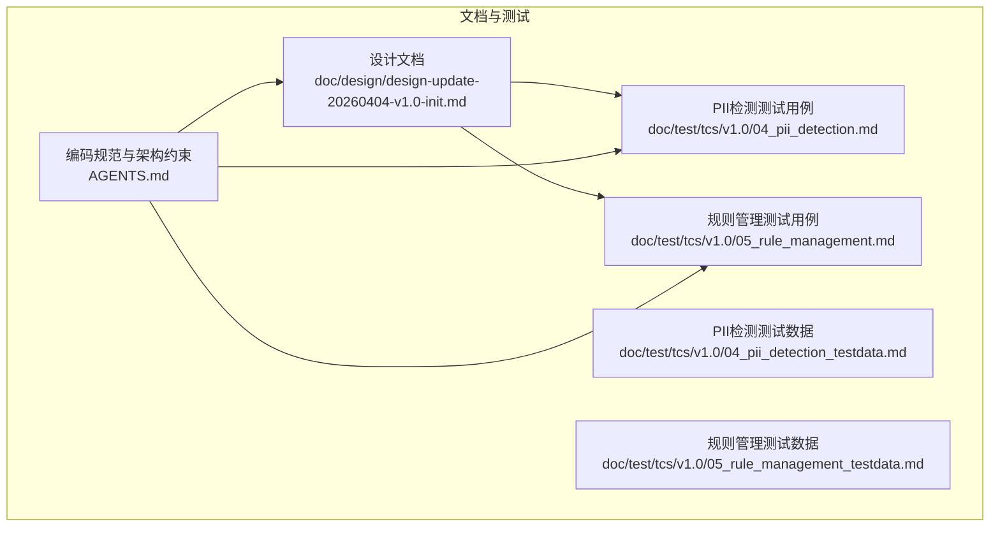
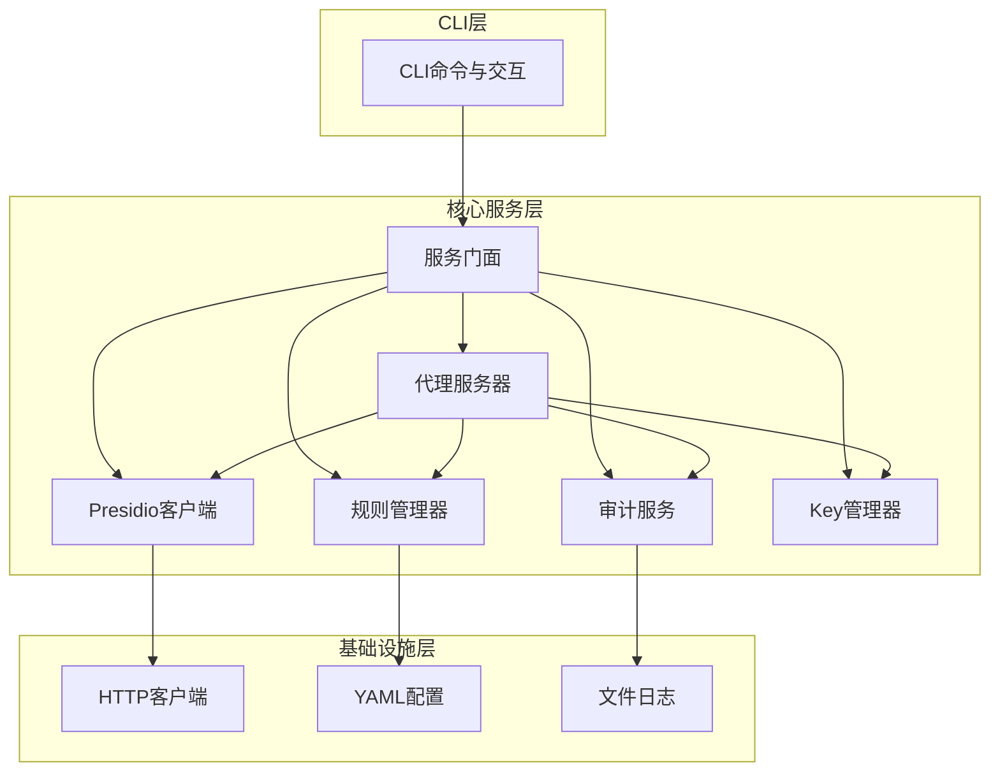
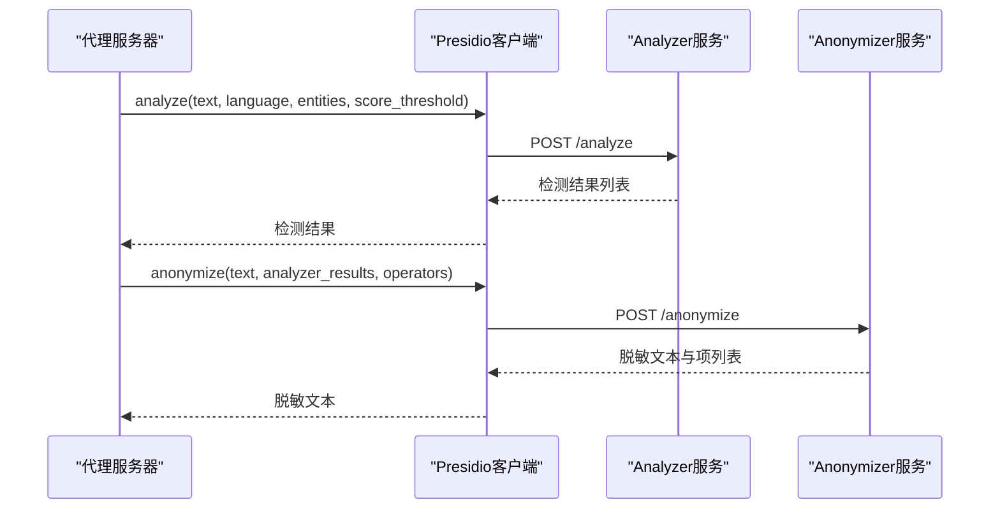
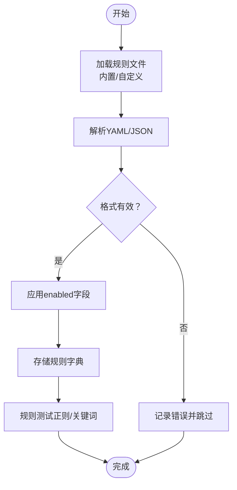
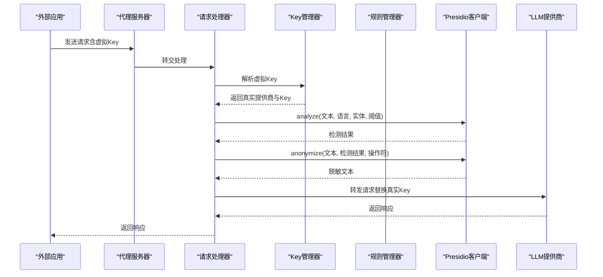
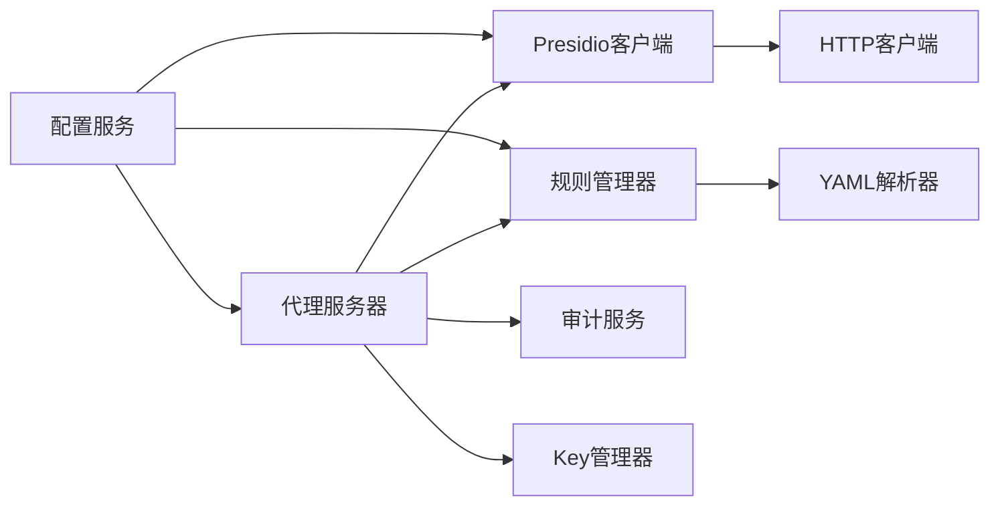

# PII检测与脱敏系统

<cite>
**本文档引用的文件**
- [design-update-20260404-v1.0-init.md](file://doc/design/design-update-20260404-v1.0-init.md)
- [04_pii_detection.md](file://doc/test/tcs/v1.0/04_pii_detection.md)
- [04_pii_detection_testdata.md](file://doc/test/tcs/v1.0/04_pii_detection_testdata.md)
- [05_rule_management.md](file://doc/test/tcs/v1.0/05_rule_management.md)
- [05_rule_management_testdata.md](file://doc/test/tcs/v1.0/05_rule_management_testdata.md)
- [AGENTS.md](file://AGENTS.md)
</cite>

## 目录
1. [简介](#简介)
2. [项目结构](#项目结构)
3. [核心组件](#核心组件)
4. [架构总览](#架构总览)
5. [详细组件分析](#详细组件分析)
6. [依赖关系分析](#依赖关系分析)
7. [性能考虑](#性能考虑)
8. [故障排除指南](#故障排除指南)
9. [结论](#结论)
10. [附录](#附录)

## 简介
本文件为 LLM Privacy Gateway v1.0 的 PII 检测与脱敏系统技术文档，围绕 Presidio 集成架构展开，系统性阐述 Analyzer 与 Anonymizer 组件的工作原理与协作机制，详解支持的实体类型、检测精度与置信度阈值设置，以及脱敏策略与操作符的适用场景。同时提供规则配置与自定义机制说明、API 参考与配置示例，以及性能优化建议与故障排除指南，帮助读者在不同业务场景下高效部署与运维。

## 项目结构
- 设计文档位于 doc/design，包含整体架构、模块设计、接口设计与配置系统。
- 测试用例位于 doc/test/tcs/v1.0，覆盖 PII 检测与脱敏、规则管理两大主题。
- 编码规范与架构约束位于 AGENTS.md，指导开发与测试实践。

**图表来源**
- [design-update-20260404-v1.0-init.md:1-2595](file://doc/design/design-update-20260404-v1.0-init.md#L1-L2595)
- [04_pii_detection.md:1-717](file://doc/test/tcs/v1.0/04_pii_detection.md#L1-L717)
- [05_rule_management.md:1-623](file://doc/test/tcs/v1.0/05_rule_management.md#L1-L623)
- [AGENTS.md:1-397](file://AGENTS.md#L1-L397)

**章节来源**
- [design-update-20260404-v1.0-init.md:1-2595](file://doc/design/design-update-20260404-v1.0-init.md#L1-L2595)
- [04_pii_detection.md:1-717](file://doc/test/tcs/v1.0/04_pii_detection.md#L1-L717)
- [05_rule_management.md:1-623](file://doc/test/tcs/v1.0/05_rule_management.md#L1-L623)
- [AGENTS.md:1-397](file://AGENTS.md#L1-L397)

## 核心组件
- Presidio 客户端：封装 Analyzer 与 Anonymizer 的 HTTP 调用，负责连接管理、健康检查与默认脱敏策略。
- 规则管理器：负责加载、启用/禁用、导入规则，支持正则与关键词两类规则，并提供规则测试能力。
- 代理服务器与请求处理器：在请求进入 LLM API 前完成虚拟 Key 验证、PII 检测与脱敏，以及可选的响应还原与审计日志记录。

**章节来源**
- [design-update-20260404-v1.0-init.md:946-1113](file://doc/design/design-update-20260404-v1.0-init.md#L946-L1113)
- [design-update-20260404-v1.0-init.md:1277-1439](file://doc/design/design-update-20260404-v1.0-init.md#L1277-L1439)
- [design-update-20260404-v1.0-init.md:570-741](file://doc/design/design-update-20260404-v1.0-init.md#L570-L741)
- [design-update-20260404-v1.0-init.md:743-939](file://doc/design/design-update-20260404-v1.0-init.md#L743-L939)

## 架构总览
系统采用四层架构：CLI、Core、Models、Utils。核心服务通过服务门面统一对外提供能力，Presidio 客户端作为外部服务集成点，规则管理器与配置系统共同支撑检测与脱敏策略的配置与执行。

**图表来源**
- [design-update-20260404-v1.0-init.md:70-122](file://doc/design/design-update-20260404-v1.0-init.md#L70-L122)
- [design-update-20260404-v1.0-init.md:411-568](file://doc/design/design-update-20260404-v1.0-init.md#L411-L568)

**章节来源**
- [design-update-20260404-v1.0-init.md:70-122](file://doc/design/design-update-20260404-v1.0-init.md#L70-L122)
- [design-update-20260404-v1.0-init.md:411-568](file://doc/design/design-update-20260404-v1.0-init.md#L411-L568)

## 详细组件分析

### Presidio 客户端（Analyzer 与 Anonymizer）
- Analyzer：接收文本、语言、实体类型与置信度阈值，调用外部 Analyzer 服务返回实体检测结果。
- Anonymizer：基于 Analyzer 结果与默认/自定义脱敏操作符，对文本进行脱敏处理并返回结果。
- 默认脱敏策略：针对常见实体类型（如 EMAIL_ADDRESS、PHONE_NUMBER、CREDIT_CARD、PERSON、LOCATION、IP_ADDRESS、URL 等）提供默认脱敏策略，支持替换、掩码等策略。
- 健康检查：定期检查 Presidio 服务可用性，保障代理服务稳定性。

**图表来源**
- [design-update-20260404-v1.0-init.md:972-1050](file://doc/design/design-update-20260404-v1.0-init.md#L972-L1050)
- [design-update-20260404-v1.0-init.md:1707-1774](file://doc/design/design-update-20260404-v1.0-init.md#L1707-L1774)

**章节来源**
- [design-update-20260404-v1.0-init.md:946-1113](file://doc/design/design-update-20260404-v1.0-init.md#L946-L1113)
- [design-update-20260404-v1.0-init.md:1703-1788](file://doc/design/design-update-20260404-v1.0-init.md#L1703-L1788)

### 规则管理器（正则与关键词）
- 规则加载：内置规则与自定义规则目录加载，支持 YAML/JSON 格式。
- 规则启用/禁用：按规则 ID 启用或禁用，支持批量操作。
- 规则测试：支持正则与关键词两类规则的测试，返回匹配位置与数量。
- 规则优先级与冲突：通过优先级排序与冲突处理策略保证规则应用的一致性。

**图表来源**
- [design-update-20260404-v1.0-init.md:1306-1339](file://doc/design/design-update-20260404-v1.0-init.md#L1306-L1339)
- [design-update-20260404-v1.0-init.md:1378-1434](file://doc/design/design-update-20260404-v1.0-init.md#L1378-L1434)

**章节来源**
- [design-update-20260404-v1.0-init.md:1277-1439](file://doc/design/design-update-20260404-v1.0-init.md#L1277-L1439)
- [05_rule_management.md:1-623](file://doc/test/tcs/v1.0/05_rule_management.md#L1-L623)
- [05_rule_management_testdata.md:1-585](file://doc/test/tcs/v1.0/05_rule_management_testdata.md#L1-L585)

### 请求处理流程（含 PII 检测与脱敏）
- 虚拟 Key 验证：解析 Authorization 头，解析虚拟 Key 并映射真实提供商与 Key。
- Presidio Analyzer：提取消息内容，构建 analyze 请求，调用外部 Analyzer 服务。
- Presidio Anonymizer：根据检测结果与默认/自定义脱敏策略，对文本进行脱敏。
- 转发请求：替换真实 Key，构建请求体，转发至 LLM API。
- 响应处理：可选的响应还原与审计日志记录。

**图表来源**
- [design-update-20260404-v1.0-init.md:743-939](file://doc/design/design-update-20260404-v1.0-init.md#L743-L939)
- [design-update-20260404-v1.0-init.md:972-1050](file://doc/design/design-update-20260404-v1.0-init.md#L972-L1050)

**章节来源**
- [design-update-20260404-v1.0-init.md:743-939](file://doc/design/design-update-20260404-v1.0-init.md#L743-L939)

## 依赖关系分析
- Presidio 客户端依赖配置服务获取端点、语言与超时设置，依赖 HTTP 客户端发起请求。
- 规则管理器依赖配置服务获取自定义规则目录，依赖 YAML 解析器加载规则文件。
- 代理服务器与请求处理器依赖 Presidio 客户端、规则管理器、审计服务与 Key 管理器。
- CLI 通过服务门面统一访问核心服务，避免跨层依赖。

**图表来源**
- [design-update-20260404-v1.0-init.md:411-568](file://doc/design/design-update-20260404-v1.0-init.md#L411-L568)
- [design-update-20260404-v1.0-init.md:946-1113](file://doc/design/design-update-20260404-v1.0-init.md#L946-L1113)
- [design-update-20260404-v1.0-init.md:1277-1439](file://doc/design/design-update-20260404-v1.0-init.md#L1277-L1439)

**章节来源**
- [design-update-20260404-v1.0-init.md:411-568](file://doc/design/design-update-20260404-v1.0-init.md#L411-L568)

## 性能考虑
- 异步 I/O：使用 aiohttp 进行 HTTP 调用，降低阻塞风险，提升并发处理能力。
- 超时与重试：Presidio 客户端设置合理超时，避免长时间阻塞；在代理层对 Presidio 服务进行健康检查，及时发现异常。
- 规则加载优化：内置规则与自定义规则分离加载，减少不必要的 IO；规则测试仅在需要时执行。
- 配置驱动：通过配置文件控制语言、实体类型与阈值，避免硬编码带来的性能与维护成本。
- 日志与审计：采用结构化日志与审计记录，便于性能监控与问题定位。

[本节为通用性能建议，无需特定文件引用]

## 故障排除指南
- Presidio 服务不可用：检查端点配置与网络连通性，确认服务健康检查返回状态。
- 超时与连接失败：调整超时参数，检查外部服务负载与资源限制。
- 规则加载失败：核对规则文件格式（YAML/JSON），确保字段完整与格式正确。
- 脱敏策略异常：检查默认策略与自定义策略配置，确认实体类型映射与操作符参数。
- 审计日志异常：检查日志文件权限与磁盘空间，确认日志轮转配置。

**章节来源**
- [design-update-20260404-v1.0-init.md:1105-1113](file://doc/design/design-update-20260404-v1.0-init.md#L1105-L1113)
- [05_rule_management_testdata.md:408-441](file://doc/test/tcs/v1.0/05_rule_management_testdata.md#L408-L441)

## 结论
本系统通过 Presidio 客户端与规则管理器的协同，实现了对多类实体的 PII 检测与脱敏，结合配置驱动与 CLI 命令，提供了灵活、可扩展的隐私保护能力。测试用例覆盖了多语言、边界情况与服务异常场景，确保在不同业务场景下的稳定性与可靠性。建议在生产环境中结合性能监控与日志审计，持续优化阈值与策略配置。

[本节为总结性内容，无需特定文件引用]

## 附录

### 支持的实体类型与脱敏策略
- 实体类型：EMAIL_ADDRESS、PHONE_NUMBER、PERSON、LOCATION、CREDIT_CARD、IP_ADDRESS、URL、CN_PHONE_NUMBER、CN_ID_CARD、CN_BANK_CARD 等。
- 脱敏策略：replace（替换）、mask（掩码）、hash（哈希）、redact（删除）。
- 默认策略：针对常见实体类型提供默认脱敏策略，可按需覆盖。

**章节来源**
- [design-update-20260404-v1.0-init.md:1085-1103](file://doc/design/design-update-20260404-v1.0-init.md#L1085-L1103)
- [04_pii_detection_testdata.md:300-337](file://doc/test/tcs/v1.0/04_pii_detection_testdata.md#L300-L337)

### 置信度阈值与实体过滤
- 置信度阈值：Analyzer 接口支持 score_threshold 参数，默认 0.5，可在代理层按需调整。
- 实体过滤：Analyzer 接口支持 entities 参数，可限定检测实体类型集合。

**章节来源**
- [design-update-20260404-v1.0-init.md:972-998](file://doc/design/design-update-20260404-v1.0-init.md#L972-L998)
- [design-update-20260404-v1.0-init.md:1709-1721](file://doc/design/design-update-20260404-v1.0-init.md#L1709-L1721)

### 规则配置与自定义
- 规则文件格式：支持 YAML 与 JSON，包含 id、name、type、pattern/keywords、category、entity_type、priority、enabled、description 等字段。
- 自定义规则目录：通过配置项指定自定义规则目录，实现规则的动态扩展。
- 规则测试：提供规则测试能力，支持正则与关键词两类规则的匹配验证。

**章节来源**
- [design-update-20260404-v1.0-init.md:1306-1339](file://doc/design/design-update-20260404-v1.0-init.md#L1306-L1339)
- [design-update-20260404-v1.0-init.md:1378-1434](file://doc/design/design-update-20260404-v1.0-init.md#L1378-L1434)
- [05_rule_management_testdata.md:408-441](file://doc/test/tcs/v1.0/05_rule_management_testdata.md#L408-L441)

### API 参考与配置示例
- Presidio Analyzer 接口：支持 text、language、score_threshold、entities 参数。
- Presidio Anonymizer 接口：支持 text、analyzer_results、operators 参数。
- 配置文件示例：包含代理、Presidio、日志、提供商、虚拟 Key、规则与脱敏策略等配置项。

**章节来源**
- [design-update-20260404-v1.0-init.md:1707-1774](file://doc/design/design-update-20260404-v1.0-init.md#L1707-L1774)
- [design-update-20260404-v1.0-init.md:1935-1990](file://doc/design/design-update-20260404-v1.0-init.md#L1935-L1990)

### 测试用例概览
- PII 检测：覆盖邮箱、手机号、身份证、信用卡、人名、地址、IP、URL 等实体类型，支持多语言与边界情况。
- 脱敏策略：覆盖 replace、mask、hash、redact 等策略，支持自定义策略配置。
- 规则管理：覆盖规则加载、启用/禁用、导入、移除、测试、配置、优先级与持久化等场景。

**章节来源**
- [04_pii_detection.md:1-717](file://doc/test/tcs/v1.0/04_pii_detection.md#L1-L717)
- [04_pii_detection_testdata.md:1-457](file://doc/test/tcs/v1.0/04_pii_detection_testdata.md#L1-L457)
- [05_rule_management.md:1-623](file://doc/test/tcs/v1.0/05_rule_management.md#L1-L623)
- [05_rule_management_testdata.md:1-585](file://doc/test/tcs/v1.0/05_rule_management_testdata.md#L1-L585)