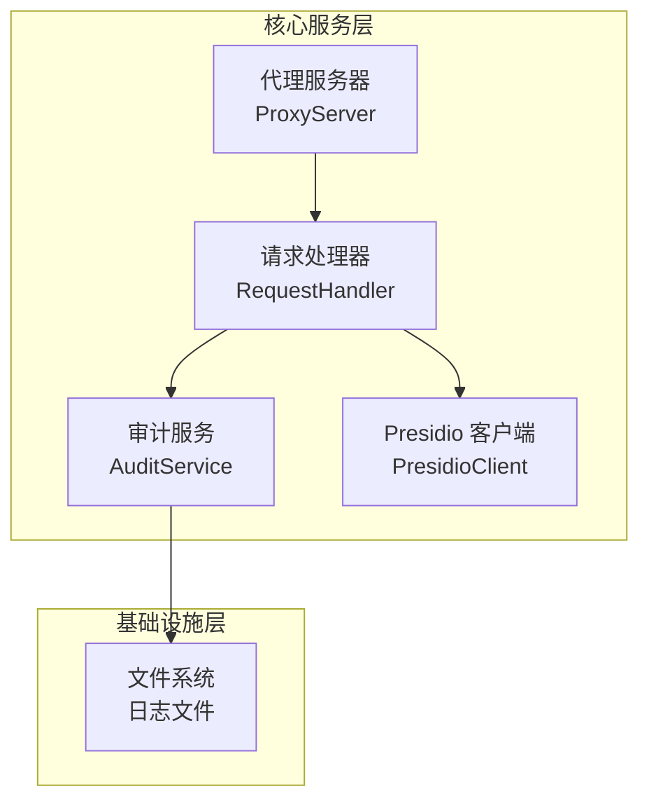
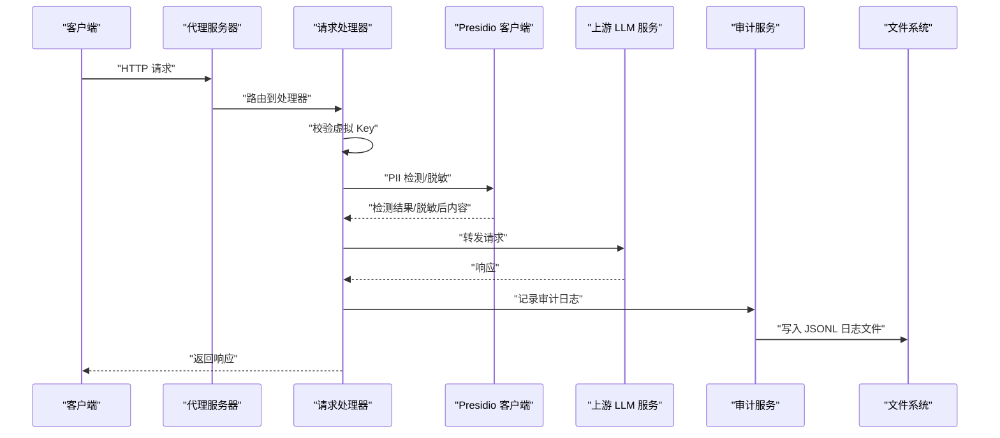
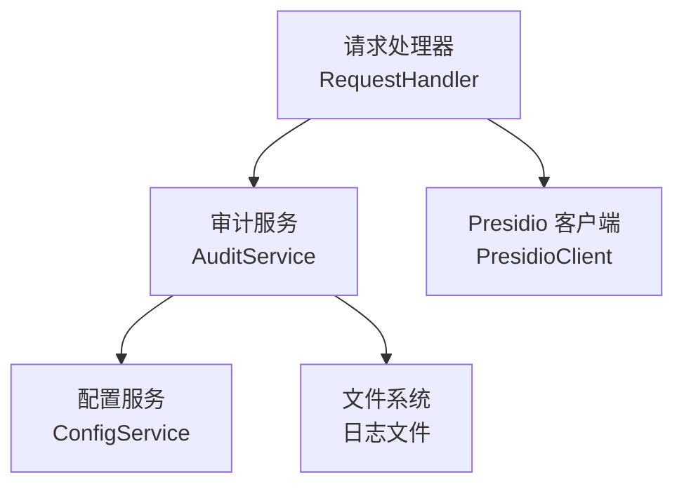

# 审计日志系统

<cite>
**本文引用的文件**
- [06_audit_logging.md](file://doc/test/tcs/v1.0/06_audit_logging.md)
- [06_audit_logging_testdata.md](file://doc/test/tcs/v1.0/06_audit_logging_testdata.md)
- [design-update-20260404-v1.0-init.md](file://doc/design/design-update-20260404-v1.0-init.md)
- [07_configuration_testdata.md](file://doc/test/tcs/v1.0/07_configuration_testdata.md)
</cite>

## 目录
1. [简介](#简介)
2. [项目结构](#项目结构)
3. [核心组件](#核心组件)
4. [架构概览](#架构概览)
5. [详细组件分析](#详细组件分析)
6. [依赖分析](#依赖分析)
7. [性能考虑](#性能考虑)
8. [故障排查指南](#故障排查指南)
9. [结论](#结论)
10. [附录](#附录)

## 简介
本文件面向 LLM Privacy Gateway 的审计日志系统，系统性阐述其设计理念、架构、数据结构、触发时机、查询与统计、导出与分析、配置选项以及性能影响评估，并结合测试用例给出实际查询示例与数据分析案例，帮助读者快速理解并高效使用该系统完成合规检查与性能分析。

## 项目结构
审计日志系统位于核心服务层的审计模块，围绕“请求处理—PII检测—脱敏—转发—响应—审计记录”的完整链路进行日志落盘。整体结构如下图所示：

图表来源
- [design-update-20260404-v1.0-init.md: 代理服务器与请求处理流程:743-944](file://doc/design/design-update-20260404-v1.0-init.md#L743-L944)
- [design-update-20260404-v1.0-init.md: 审计服务实现:1441-1640](file://doc/design/design-update-20260404-v1.0-init.md#L1441-L1640)

章节来源
- [design-update-20260404-v1.0-init.md: 代理服务器与请求处理流程:743-944](file://doc/design/design-update-20260404-v1.0-init.md#L743-L944)
- [design-update-20260404-v1.0-init.md: 审计服务实现:1441-1640](file://doc/design/design-update-20260404-v1.0-init.md#L1441-L1640)

## 核心组件
- 审计服务（AuditService）：负责日志条目的构造、落盘、查询、统计与导出。
- 请求处理器（RequestHandler）：在请求处理完成后调用审计服务记录日志。
- 配置系统：提供审计开关、日志文件路径、保留策略等配置项。

章节来源
- [design-update-20260404-v1.0-init.md: 审计服务实现:1441-1640](file://doc/design/design-update-20260404-v1.0-init.md#L1441-L1640)
- [design-update-20260404-v1.0-init.md: 请求处理器与审计记录调用:889-944](file://doc/design/design-update-20260404-v1.0-init.md#L889-L944)

## 架构概览
审计日志贯穿请求生命周期的关键节点，形成“请求—处理—响应—记录”的闭环。下图展示了审计日志在请求处理中的触发时机与数据流向：

图表来源
- [design-update-20260404-v1.0-init.md: 请求处理完整流程:164-250](file://doc/design/design-update-20260404-v1.0-init.md#L164-L250)
- [design-update-20260404-v1.0-init.md: 审计服务日志记录:1482-1520](file://doc/design/design-update-20260404-v1.0-init.md#L1482-L1520)

## 详细组件分析

### 审计服务（AuditService）
- 职责
  - 构造审计条目并以 JSONL 格式追加写入日志文件。
  - 提供日志查询、统计与导出能力。
- 关键方法
  - log_request：记录请求处理结果（URL、方法、状态码、耗时、PII 检测结果、是否流式、错误信息等）。
  - get_logs：按行数、级别（模拟）、时间范围过滤查询。
  - get_stats：聚合统计（总请求数、成功/失败、PII 检测总数、平均耗时、PII 类型分布）。
  - export：将指定时间范围内的日志导出为 JSON 文件。
- 数据落盘
  - 默认路径：用户主目录下的 .llm-privacy-gateway/logs/audit.jsonl。
  - 文件采用 JSONL（每行一个 JSON 对象），便于流式读取与分析。

章节来源
- [design-update-20260404-v1.0-init.md: 审计服务实现:1441-1640](file://doc/design/design-update-20260404-v1.0-init.md#L1441-L1640)

### 请求处理器（RequestHandler）与审计触发
- 触发时机
  - 普通响应：在收到上游响应后立即记录日志。
  - 流式响应：在流式传输结束后记录日志（标记 is_stream=true）。
- 记录内容
  - URL、方法、状态码、耗时（毫秒）、PII 检测结果（实体类型、置信度）、PII 数量、是否流式、错误信息（如有）。

章节来源
- [design-update-20260404-v1.0-init.md: 请求处理与审计记录调用:889-944](file://doc/design/design-update-20260404-v1.0-init.md#L889-L944)

### 日志条目字段定义（JSONL）
- 必填字段
  - timestamp：ISO 8601 时间戳（含微秒与时区信息）。
  - url：请求的目标 URL。
  - method：HTTP 方法（如 POST）。
  - status：响应状态码（如 200、401、500）。
  - duration_ms：请求总耗时（毫秒，保留两位小数）。
- 可选字段
  - detections：PII 检测结果数组，包含 entity_type、score 等。
  - pii_count：检测到的 PII 数量。
  - is_stream：是否为流式响应。
  - error：错误信息（如上游超时、鉴权失败等）。
- 示例参考
  - 完整日志条目示例与字段说明参见测试数据文档。

章节来源
- [06_audit_logging_testdata.md: 完整日志条目示例与字段说明:365-493](file://doc/test/tcs/v1.0/06_audit_logging_testdata.md#L365-L493)
- [design-update-20260404-v1.0-init.md: 审计日志模型:1910-1927](file://doc/design/design-update-20260404-v1.0-init.md#L1910-L1927)

### 日志查询与统计
- 查询能力
  - 最近 N 条日志：按时间倒序返回指定数量。
  - 时间范围查询：支持 1h、1d、1w、1m 等范围过滤。
  - 级别过滤（模拟）：根据状态码范围模拟 info/warn/error。
  - 关键词搜索：可在日志内容中进行关键词匹配（由上层调用实现）。
- 统计能力
  - 总请求数、成功/失败请求数、PII 检测总数、平均耗时。
  - PII 类型分布（按 entity_type 统计）。
- 查询示例（基于测试用例）
  - 查询最近 10 条日志：TC-AUDIT-007
  - 按时间范围查询（1h/1d/1w/1m）：TC-AUDIT-008
  - 按日志级别过滤（info/warn/error）：TC-AUDIT-009
  - 组合条件查询（时间+级别/关键词）：TC-AUDIT-011
  - 统计请求数/成功率/PII 检测数/平均延迟/PII 类型分布：TC-AUDIT-013 至 TC-AUDIT-017

章节来源
- [06_audit_logging.md: 日志查询与统计测试用例:87-246](file://doc/test/tcs/v1.0/06_audit_logging.md#L87-L246)
- [06_audit_logging_testdata.md: 查询条件与统计信息测试数据:495-597](file://doc/test/tcs/v1.0/06_audit_logging_testdata.md#L495-L597)

### 日志导出与分析
- 导出能力
  - 支持将指定时间范围内的日志导出为 JSON 文件。
  - 导出路径可自定义，支持相对路径与绝对路径。
- 分析能力
  - 基于统计接口可快速生成成功率、PII 分布、平均耗时等报表。
  - 结合查询接口可进行趋势分析与异常定位。

章节来源
- [06_audit_logging.md: 日志导出测试用例:247-287](file://doc/test/tcs/v1.0/06_audit_logging.md#L247-L287)
- [06_audit_logging_testdata.md: 导出格式与路径测试数据:598-633](file://doc/test/tcs/v1.0/06_audit_logging_testdata.md#L598-L633)

### 配置选项
- 审计开关（enabled）
  - 控制是否启用审计日志记录。
- 日志文件路径（log_file）
  - 默认路径为 ~/.llm-privacy-gateway/logs/audit.jsonl。
- 保留策略（retention_days）
  - 日志保留天数，默认 30 天。
- 配置来源与优先级
  - 命令行参数 > 环境变量 > 本地配置 > 全局配置 > 默认值。
- 环境变量映射
  - LPG_AUDIT_ENABLED：控制审计开关。
  - LPG_AUDIT_LOG_FILE：自定义审计日志文件路径。
  - LPG_AUDIT_RETENTION_DAYS：自定义保留天数。

章节来源
- [07_configuration_testdata.md: 审计配置测试数据:510-562](file://doc/test/tcs/v1.0/07_configuration_testdata.md#L510-L562)
- [07_configuration_testdata.md: 环境变量测试数据:563-591](file://doc/test/tcs/v1.0/07_configuration_testdata.md#L563-L591)
- [design-update-20260404-v1.0-init.md: 审计配置模型与默认值:1863-1868](file://doc/design/design-update-20260404-v1.0-init.md#L1863-L1868)

### 性能影响评估
- 写入开销
  - JSONL 追加写入，单条日志体积较小，写入延迟通常在毫秒级。
- 查询性能
  - 读取整个日志文件并按需过滤，适合中小规模日志（建议配合时间范围与行数限制）。
- 导出性能
  - 导出为 JSON 文件，适合离线分析与备份。
- 建议
  - 在高并发场景下，建议开启时间范围过滤与行数限制，避免一次性扫描全量日志。
  - 对于大规模日志，建议结合外部日志平台或定期归档。

章节来源
- [06_audit_logging.md: 日志性能测试用例:370-410](file://doc/test/tcs/v1.0/06_audit_logging.md#L370-L410)
- [06_audit_logging_testdata.md: 性能测试数据:713-732](file://doc/test/tcs/v1.0/06_audit_logging_testdata.md#L713-L732)

## 依赖分析
审计日志系统与其他模块的耦合关系如下：

图表来源
- [design-update-20260404-v1.0-init.md: 服务门面与审计服务依赖:422-438](file://doc/design/design-update-20260404-v1.0-init.md#L422-L438)
- [design-update-20260404-v1.0-init.md: 审计服务实现:1441-1640](file://doc/design/design-update-20260404-v1.0-init.md#L1441-L1640)

章节来源
- [design-update-20260404-v1.0-init.md: 服务门面与审计服务依赖:422-438](file://doc/design/design-update-20260404-v1.0-init.md#L422-L438)

## 性能考虑
- 写入策略
  - JSONL 追加写入，避免随机写入带来的性能损耗。
- 查询策略
  - 建议使用时间范围过滤与行数限制，减少内存占用与 IO 压力。
- 导出策略
  - 导出为 JSON 文件，适合离线分析；注意磁盘空间与 IO 带宽。
- 建议的优化方向
  - 引入索引或分区（按日期）以提升查询效率。
  - 对高频查询引入缓存层（短期统计结果）。

## 故障排查指南
- 无法写入日志文件
  - 检查日志文件路径是否存在且具有写权限。
  - 参考配置测试数据中的无效路径示例与预期错误。
- 日志为空
  - 确认审计开关已启用，且请求已到达审计记录点。
  - 使用“查询空日志”测试用例验证查询接口。
- 查询结果异常
  - 检查时间范围参数格式（1h/1d/1w/1m）。
  - 确认级别过滤逻辑（模拟状态码范围）。
- 导出失败
  - 检查输出路径权限与磁盘空间。
  - 确认导出接口返回的记录数与预期一致。

章节来源
- [06_audit_logging.md: 查询空日志与导出空日志测试用例:154-166](file://doc/test/tcs/v1.0/06_audit_logging.md#L154-L166)
- [06_audit_logging_testdata.md: 无效导出路径与文件路径测试数据:625-633](file://doc/test/tcs/v1.0/06_audit_logging_testdata.md#L625-L633)
- [07_configuration_testdata.md: 无效日志文件路径与权限测试数据:536-543](file://doc/test/tcs/v1.0/07_configuration_testdata.md#L536-L543)

## 结论
LLM Privacy Gateway 的审计日志系统以 JSONL 格式记录请求处理全过程，覆盖 PII 检测、脱敏、上游交互与错误信息等关键维度。通过配置化的开关、路径与保留策略，系统在易用性与合规性之间取得平衡。结合查询、统计与导出能力，可满足日常运维、合规审计与性能分析需求。建议在高并发场景下配合时间范围与行数限制，以获得更佳的性能表现。

## 附录

### 实际查询示例与数据分析案例
- 案例一：定位异常请求
  - 步骤
    - 使用时间范围查询（如最近 1h）。
    - 按级别过滤（error/warn）。
    - 关键词搜索（如“timeout”、“429”）。
  - 目的：快速定位超时、限流与认证失败等异常。
- 案例二：PII 检测合规分析
  - 步骤
    - 统计 PII 类型分布（EMAIL_ADDRESS、PHONE_NUMBER 等）。
    - 计算各类型占比，识别高风险类型。
  - 目的：评估数据暴露风险与脱敏策略有效性。
- 案例三：性能基线与趋势分析
  - 步骤
    - 统计平均耗时与成功率。
    - 按小时/天粒度绘制趋势图。
  - 目的：识别性能瓶颈与波动原因。

章节来源
- [06_audit_logging.md: 查询与统计测试用例:87-246](file://doc/test/tcs/v1.0/06_audit_logging.md#L87-L246)
- [06_audit_logging_testdata.md: 统计信息测试数据:547-597](file://doc/test/tcs/v1.0/06_audit_logging_testdata.md#L547-L597)