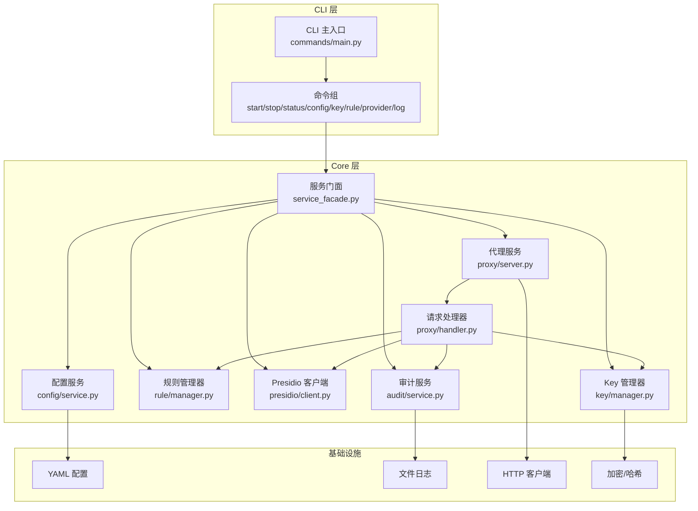
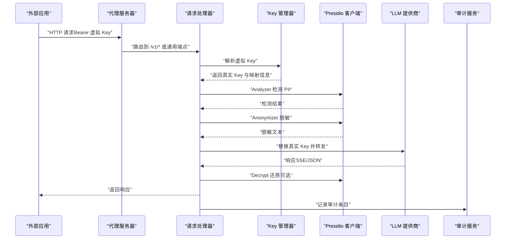
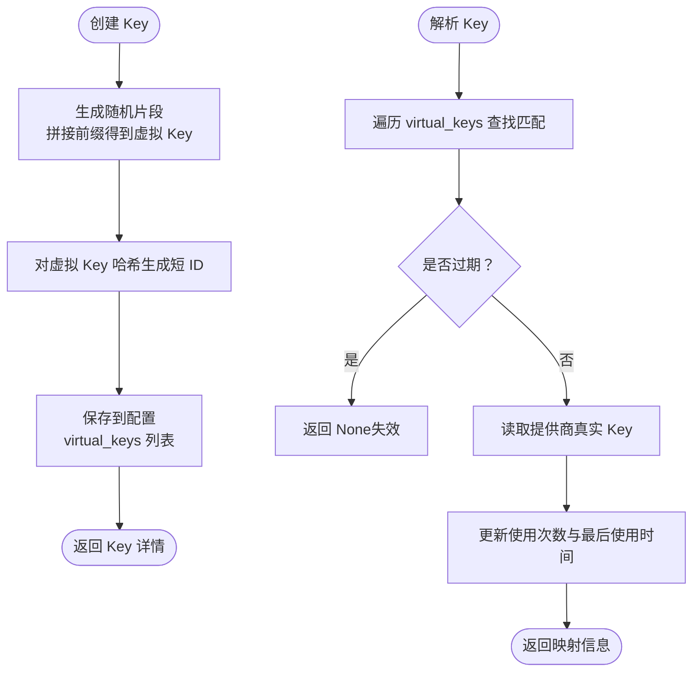
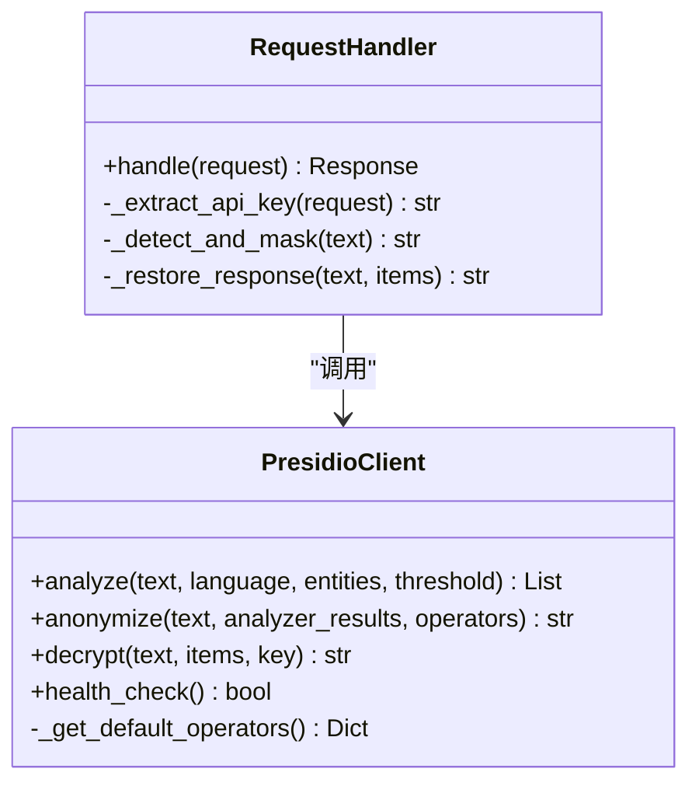
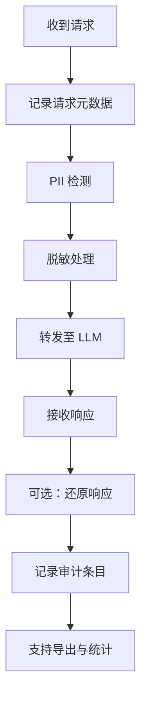
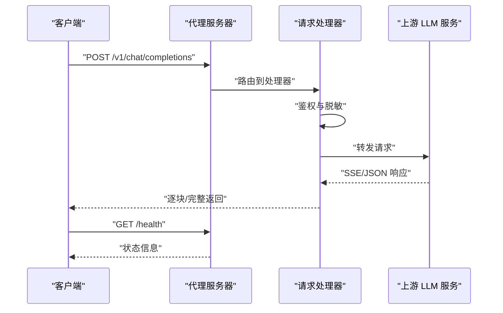
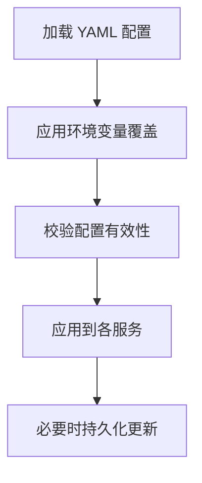
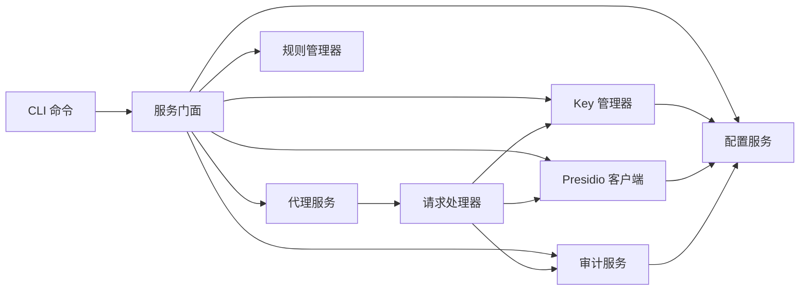

# 核心功能特性

<cite>
**本文引用的文件**
- [设计文档](file://doc/design/design-update-20260404-v1.0-init.md)
- [代理服务测试用例](file://doc/test/tcs/v1.0/02_proxy_service.md)
- [Key 管理测试用例](file://doc/test/tcs/v1.0/03_key_management.md)
- [PII 检测测试用例](file://doc/test/tcs/v1.0/04_pii_detection.md)
- [审计日志测试用例](file://doc/test/tcs/v1.0/06_audit_logging.md)
- [配置样例](file://doc/test/tcs/v1.0/test_data/config_sample.yaml)
- [提供商样例](file://doc/test/tcs/v1.0/test_data/providers_sample.yaml)
- [环境变量覆盖样例](file://doc/test/tcs/v1.0/test_data/config_env_override.yaml)
- [无效配置样例](file://doc/test/tcs/v1.0/test_data/config_invalid.yaml)
</cite>

## 目录
1. [简介](#简介)
2. [项目结构](#项目结构)
3. [核心组件](#核心组件)
4. [架构总览](#架构总览)
5. [详细组件分析](#详细组件分析)
6. [依赖关系分析](#依赖关系分析)
7. [性能考量](#性能考量)
8. [故障排查指南](#故障排查指南)
9. [结论](#结论)
10. [附录](#附录)

## 简介
本文件系统化阐述 LLM Privacy Gateway 的核心功能特性，围绕以下主题展开：
- 虚拟 Key 管理系统：生成、验证、吊销、统计与生命周期管理
- PII 检测与脱敏机制：基于 Presidio 的检测、规则配置、脱敏策略与还原流程
- 审计日志系统：请求记录、查询、统计与导出能力
- HTTP 代理服务：OpenAI API 兼容、请求路由与响应处理
- 配置管理系统：YAML 配置、环境变量覆盖与动态更新

每个功能均结合测试用例与设计文档，给出实现原理、数据流、关键流程图以及实际使用场景，帮助读者快速理解并落地应用。

## 项目结构
项目采用四层架构（CLI → Core → Models → Utils），核心模块包括：
- CLI 层：命令行入口与命令实现
- Core 层：代理服务、Key 管理、规则管理、Presidio 客户端、审计服务、配置服务
- Models 层：数据模型
- Utils 层：通用工具

**图表来源**
- [设计文档:70-162](file://doc/design/design-update-20260404-v1.0-init.md#L70-L162)

**章节来源**
- [设计文档:25-68](file://doc/design/design-update-20260404-v1.0-init.md#L25-L68)

## 核心组件
- 服务门面（ServiceFacade）：统一对外接口，屏蔽服务间依赖，便于扩展
- 代理服务器（ProxyServer）：基于 aiohttp 的 HTTP 代理，支持 OpenAI API 兼容端点
- 请求处理器（RequestHandler）：鉴权、PII 检测/脱敏、转发、流式响应与审计记录
- Key 管理器（KeyManager）：虚拟 Key 生成、解析、生命周期管理与使用统计
- Presidio 客户端（PresidioClient）：封装 Analyzer/Anonymizer/Decrypt 接口
- 审计服务（AuditService）：请求审计记录、查询、统计与导出
- 配置服务（ConfigService）：YAML 配置加载、环境变量覆盖与动态更新

**章节来源**
- [设计文档:411-568](file://doc/design/design-update-20260404-v1.0-init.md#L411-L568)

## 架构总览
整体数据流从外部应用请求开始，依次经过虚拟 Key 验证、PII 检测与脱敏、真实 Key 替换、LLM API 转发、响应还原与审计记录。

**图表来源**
- [设计文档:164-250](file://doc/design/design-update-20260404-v1.0-init.md#L164-L250)

**章节来源**
- [设计文档:162-250](file://doc/design/design-update-20260404-v1.0-init.md#L162-L250)

## 详细组件分析

### 虚拟 Key 管理系统
- 生成：使用安全随机数生成虚拟 Key，采用固定前缀与哈希 ID，保证唯一性与可追溯性
- 验证：解析 Authorization 头，匹配虚拟 Key，校验提供商与过期时间
- 吊销：删除 Key 记录，使其立即失效
- 统计：记录使用次数与最后使用时间，支持查询与导出
- 生命周期：支持设置过期时间，过期 Key 自动失效

**图表来源**
- [设计文档:1115-1275](file://doc/design/design-update-20260404-v1.0-init.md#L1115-L1275)

**章节来源**
- [设计文档:1115-1275](file://doc/design/design-update-20260404-v1.0-init.md#L1115-L1275)
- [Key 管理测试用例:36-125](file://doc/test/tcs/v1.0/03_key_management.md#L36-L125)

#### 使用场景
- 为不同提供商生成独立虚拟 Key，隔离真实密钥
- 为短期项目或临时账号设置过期时间，降低泄露风险
- 通过吊销机制快速处置异常 Key，保障安全

#### 关键实现要点
- 虚拟 Key 前缀与长度校验，确保格式正确
- 过期时间比较采用 ISO 时间格式解析
- 使用统计更新采用原子持久化，防止并发覆盖

**章节来源**
- [Key 管理测试用例:128-202](file://doc/test/tcs/v1.0/03_key_management.md#L128-L202)

### PII 检测与脱敏机制
- Presidio 集成：封装 Analyzer/Anonymizer/Decrypt 接口，支持多实体类型与多语言
- 检测规则：支持置信度阈值、实体类型过滤与自定义策略
- 脱敏策略：内置多种策略（replace、mask、hash、redact），可按实体类型定制
- 还原机制：在响应处理阶段可选地进行还原，确保日志与调试可见性

**图表来源**
- [设计文档:946-1113](file://doc/design/design-update-20260404-v1.0-init.md#L946-L1113)
- [设计文档:743-800](file://doc/design/design-update-20260404-v1.0-init.md#L743-L800)

**章节来源**
- [设计文档:946-1113](file://doc/design/design-update-20260404-v1.0-init.md#L946-L1113)
- [PII 检测测试用例:40-206](file://doc/test/tcs/v1.0/04_pii_detection.md#L40-L206)

#### 使用场景
- 请求消息中自动检测并脱敏邮箱、手机号、身份证号等
- 配置不同实体类型的脱敏策略，满足合规要求
- 在流式响应场景中进行实时或批量脱敏

#### 关键实现要点
- Analyzer/Anonymizer 采用异步 HTTP 客户端，避免阻塞
- 默认策略覆盖常见实体类型，支持按需扩展
- 健康检查与超时处理提升系统鲁棒性

**章节来源**
- [PII 检测测试用例:547-638](file://doc/test/tcs/v1.0/04_pii_detection.md#L547-L638)

### 审计日志系统
- 记录：请求时间、客户端 IP、请求路径、状态码、耗时、PII 检测结果与脱敏动作
- 查询：支持按时间范围、日志级别、关键词组合查询
- 统计：请求数、成功率、平均延迟、PII 类型分布与时序统计
- 导出：支持 JSON 格式导出，便于离线分析与合规审计

**图表来源**
- [设计文档:238-249](file://doc/design/design-update-20260404-v1.0-init.md#L238-L249)

**章节来源**
- [审计日志测试用例:7-86](file://doc/test/tcs/v1.0/06_audit_logging.md#L7-L86)
- [审计日志测试用例:87-166](file://doc/test/tcs/v1.0/06_audit_logging.md#L87-L166)
- [审计日志测试用例:167-246](file://doc/test/tcs/v1.0/06_audit_logging.md#L167-L246)
- [审计日志测试用例:247-287](file://doc/test/tcs/v1.0/06_audit_logging.md#L247-L287)

#### 使用场景
- 安全审计：追踪敏感数据处理轨迹
- 运维监控：统计成功率与延迟，定位性能瓶颈
- 合规报告：导出指定时间范围的审计数据

#### 关键实现要点
- JSON 格式日志，字段完整且类型一致
- 支持多种时间粒度的统计与查询
- 导出过程不影响在线日志写入

**章节来源**
- [审计日志测试用例:329-410](file://doc/test/tcs/v1.0/06_audit_logging.md#L329-L410)

### HTTP 代理服务
- OpenAI API 兼容：支持 /v1/chat/completions、/v1/completions、/v1/embeddings 等端点
- 请求路由：通用端点支持任意路径转发至配置的提供商
- 响应处理：支持 SSE 流式响应与 JSON 响应，包含错误处理与超时控制
- 健康检查：/health 端点返回服务状态与运行时信息

**图表来源**
- [设计文档:570-742](file://doc/design/design-update-20260404-v1.0-init.md#L570-L742)

**章节来源**
- [代理服务测试用例:253-422](file://doc/test/tcs/v1.0/02_proxy_service.md#L253-L422)
- [代理服务测试用例:423-513](file://doc/test/tcs/v1.0/02_proxy_service.md#L423-L513)
- [代理服务测试用例:776-800](file://doc/test/tcs/v1.0/02_proxy_service.md#L776-L800)

#### 使用场景
- 本地开发与测试：无需直接暴露真实 API Key
- 多提供商切换：通过配置快速切换 OpenAI/Azure Anthropic 等
- 流式对话：稳定支持 SSE 流式响应

**章节来源**
- [代理服务测试用例:423-513](file://doc/test/tcs/v1.0/02_proxy_service.md#L423-L513)

### 配置管理系统
- YAML 配置：proxy、providers、rules、audit 等核心配置项
- 环境变量覆盖：支持通过环境变量对关键配置进行覆盖
- 动态更新：配置服务支持读取与写回，实现运行时配置调整

**图表来源**
- [设计文档:523-568](file://doc/design/design-update-20260404-v1.0-init.md#L523-L568)

**章节来源**
- [配置样例:1-27](file://doc/test/tcs/v1.0/test_data/config_sample.yaml#L1-L27)
- [提供商样例:1-25](file://doc/test/tcs/v1.0/test_data/providers_sample.yaml#L1-L25)
- [环境变量覆盖样例:1-16](file://doc/test/tcs/v1.0/test_data/config_env_override.yaml#L1-L16)
- [无效配置样例:1-29](file://doc/test/tcs/v1.0/test_data/config_invalid.yaml#L1-L29)

#### 使用场景
- 开发环境与生产环境差异化：通过环境变量覆盖端口、超时、日志级别等
- 快速切换提供商：在 YAML 中配置多个提供商，按需启用/禁用
- 规则与审计开关：通过配置控制规则加载与审计日志输出

**章节来源**
- [配置样例:13-27](file://doc/test/tcs/v1.0/test_data/config_sample.yaml#L13-L27)
- [提供商样例:3-25](file://doc/test/tcs/v1.0/test_data/providers_sample.yaml#L3-L25)

## 依赖关系分析
- 低耦合高内聚：CLI 通过服务门面访问核心服务，避免跨层调用
- 依赖注入：核心服务通过构造函数注入，便于测试与扩展
- 外部依赖：Presidio 服务、LLM 提供商 API、文件系统与网络

**图表来源**
- [设计文档:124-161](file://doc/design/design-update-20260404-v1.0-init.md#L124-L161)

**章节来源**
- [设计文档:124-161](file://doc/design/design-update-20260404-v1.0-init.md#L124-L161)

## 性能考量
- 异步 I/O：代理与 Presidio 调用均采用异步，避免阻塞主线程
- 超时控制：配置合理的超时时间，防止请求堆积
- 流式处理：SSE 响应按块传输，减少内存占用
- 统计与监控：内置统计字段，便于性能观测与优化

[本节为通用指导，无需引用具体文件]

## 故障排查指南
- 虚拟 Key 相关
  - 401 错误：检查 Authorization 头格式与 Key 是否存在/未过期
  - 吊销 Key：确认 Key 已删除或状态为已吊销
- Presidio 集成
  - 连接失败/超时：检查服务端点、网络连通性与超时配置
  - 检测结果为空：调整置信度阈值或实体类型过滤
- 代理服务
  - 端口占用：更换端口或停止占用进程
  - 健康检查失败：查看日志与配置，确认服务已启动
- 审计日志
  - 日志缺失：检查日志级别与文件路径权限
  - 查询无结果：确认时间范围与关键词匹配

**章节来源**
- [代理服务测试用例:515-630](file://doc/test/tcs/v1.0/02_proxy_service.md#L515-L630)
- [Key 管理测试用例:145-187](file://doc/test/tcs/v1.0/03_key_management.md#L145-L187)
- [PII 检测测试用例:547-591](file://doc/test/tcs/v1.0/04_pii_detection.md#L547-L591)
- [审计日志测试用例:370-410](file://doc/test/tcs/v1.0/06_audit_logging.md#L370-L410)

## 结论
LLM Privacy Gateway 通过虚拟 Key 管理、PII 检测与脱敏、审计日志与 HTTP 代理四大能力，构建了完整的隐私保护闭环。其模块化设计与配置驱动特性，既满足 MVP 的快速落地，又为后续扩展预留空间。结合测试用例与设计文档，用户可在本地开发、企业合规与多提供商场景中高效部署与运维。

[本节为总结性内容，无需引用具体文件]

## 附录
- 测试数据与用例：详见各模块测试用例文档
- 配置示例：YAML、环境变量覆盖与无效配置样例
- 版本与范围：v1.0 MVP 覆盖核心功能，后续版本逐步增强

**章节来源**
- [配置样例:1-27](file://doc/test/tcs/v1.0/test_data/config_sample.yaml#L1-L27)
- [提供商样例:1-25](file://doc/test/tcs/v1.0/test_data/providers_sample.yaml#L1-L25)
- [环境变量覆盖样例:1-16](file://doc/test/tcs/v1.0/test_data/config_env_override.yaml#L1-L16)
- [无效配置样例:1-29](file://doc/test/tcs/v1.0/test_data/config_invalid.yaml#L1-L29)