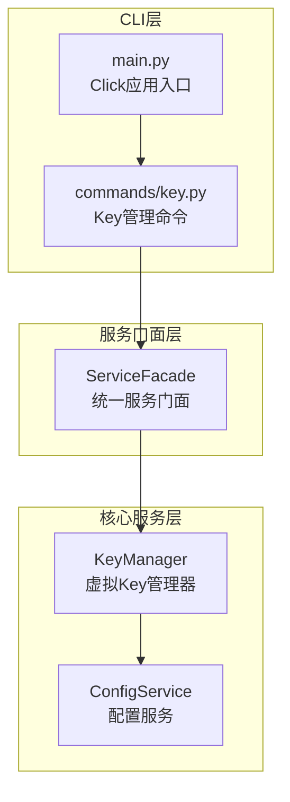
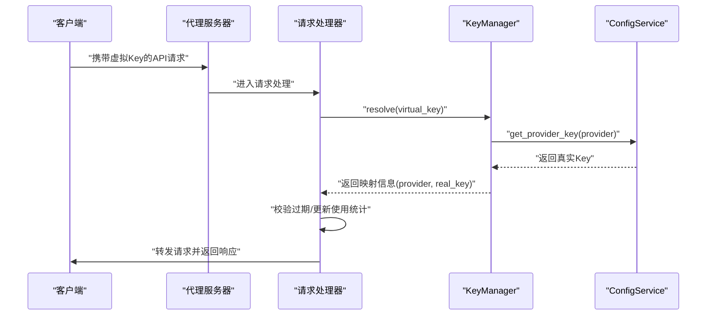
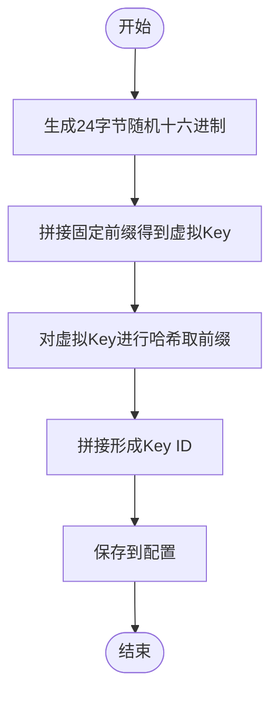
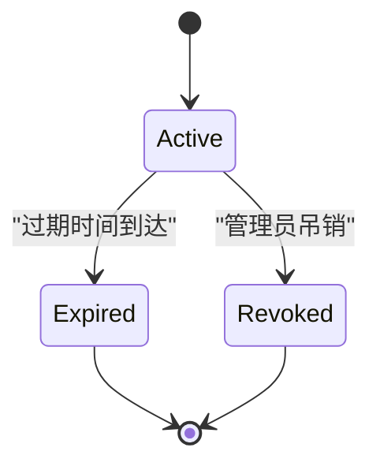
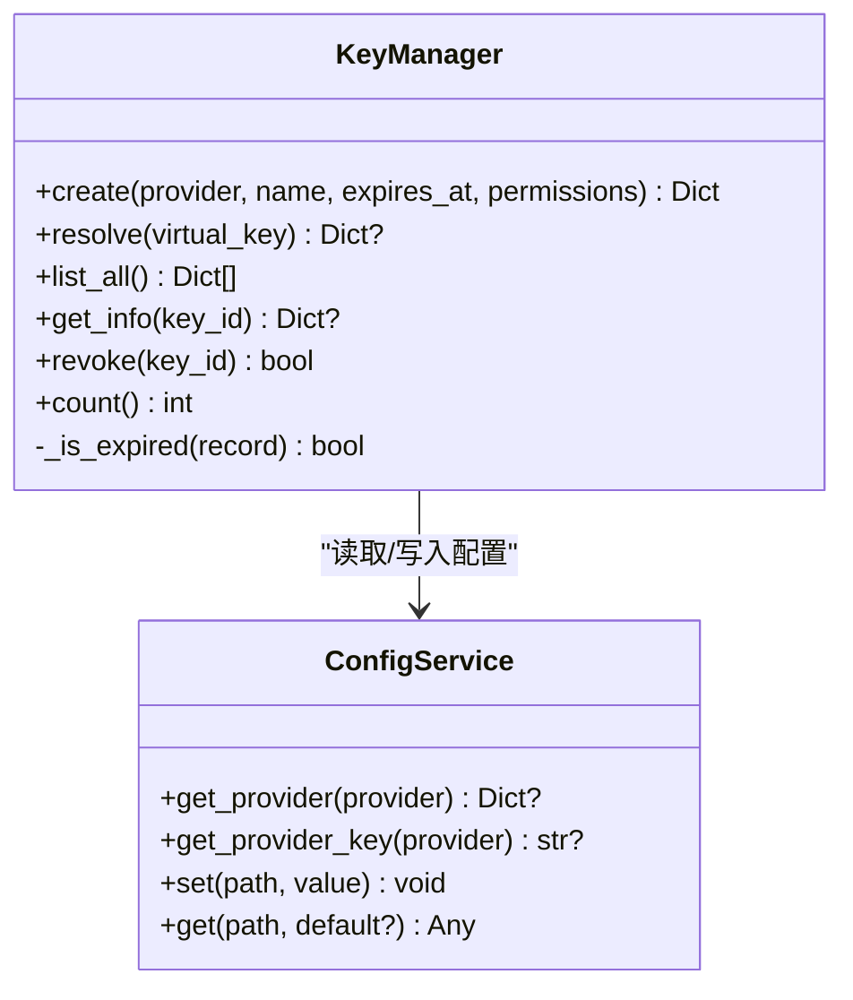

# 虚拟Key管理系统

<cite>
**本文档引用的文件**
- [design-update-20260404-v1.0-init.md](file://doc/design/design-update-20260404-v1.0-init.md)
- [03_key_management.md](file://doc/test/tcs/v1.0/03_key_management.md)
- [03_key_management_testdata.md](file://doc/test/tcs/v1.0/03_key_management_testdata.md)
- [01_cli_commands.md](file://doc/test/tcs/v1.0/01_cli_commands.md)
- [AGENTS.md](file://AGENTS.md)
</cite>

## 目录
1. [简介](#简介)
2. [项目结构](#项目结构)
3. [核心组件](#核心组件)
4. [架构总览](#架构总览)
5. [详细组件分析](#详细组件分析)
6. [依赖关系分析](#依赖关系分析)
7. [性能考虑](#性能考虑)
8. [故障排除指南](#故障排除指南)
9. [结论](#结论)
10. [附录](#附录)

## 简介
本文件为 LLM Privacy Gateway v1.0 虚拟Key管理系统的权威功能文档。系统通过“虚拟Key”对真实提供商API Key进行安全隔离与生命周期管理，支持创建、解析、列表、详情、吊销、过期处理与使用统计等完整能力。本文档基于设计文档与黑盒测试用例，系统阐述虚拟Key的核心概念、工作原理、数据模型、API与CLI参考、使用示例、安全策略与性能优化建议。

## 项目结构
- 关键实现位于核心服务层的 Key 管理模块，由服务门面统一对外暴露。
- CLI 层通过 Click 定义命令，委托服务门面完成具体操作。
- 配置服务负责虚拟Key持久化与提供商配置读取。

图表来源
- [design-update-20260404-v1.0-init.md:280-311](file://doc/design/design-update-20260404-v1.0-init.md#L280-L311)
- [design-update-20260404-v1.0-init.md:411-568](file://doc/design/design-update-20260404-v1.0-init.md#L411-L568)
- [design-update-20260404-v1.0-init.md:1115-1175](file://doc/design/design-update-20260404-v1.0-init.md#L1115-L1175)

章节来源
- [design-update-20260404-v1.0-init.md:254-279](file://doc/design/design-update-20260404-v1.0-init.md#L254-L279)
- [design-update-20260404-v1.0-init.md:280-311](file://doc/design/design-update-20260404-v1.0-init.md#L280-L311)
- [design-update-20260404-v1.0-init.md:411-568](file://doc/design/design-update-20260404-v1.0-init.md#L411-L568)

## 核心组件
- KeyManager：负责虚拟Key生成、映射解析、生命周期管理（过期检查）、使用统计更新与持久化。
- ConfigService：提供提供商配置读取、真实Key获取与虚拟Key集合的读写。
- ServiceFacade：CLI与核心服务的统一门面，屏蔽服务间耦合。
- CLI key 命令：对外暴露 create/list/show/revoke 等子命令。

章节来源
- [design-update-20260404-v1.0-init.md:1115-1175](file://doc/design/design-update-20260404-v1.0-init.md#L1115-L1175)
- [design-update-20260404-v1.0-init.md:411-568](file://doc/design/design-update-20260404-v1.0-init.md#L411-L568)

## 架构总览
虚拟Key解析的关键流程：客户端携带虚拟Key发起请求，代理服务器调用KeyManager解析，校验有效性与过期状态，获取真实提供商Key并转发至相应LLM提供商。

图表来源
- [design-update-20260404-v1.0-init.md:762-800](file://doc/design/design-update-20260404-v1.0-init.md#L762-L800)
- [design-update-20260404-v1.0-init.md:1198-1232](file://doc/design/design-update-20260404-v1.0-init.md#L1198-L1232)

## 详细组件分析

### 虚拟Key生成与唯一标识
- 生成算法
  - 随机部分：使用安全随机源生成24字节十六进制字符串。
  - 前缀：固定前缀标识虚拟Key。
  - 唯一ID：对完整虚拟Key进行哈希取前16字符作为Key ID前缀，并拼接形成最终ID。
- 唯一性保障
  - 随机源保证高熵；哈希取前缀形成紧凑ID；整体组合在合理规模内几乎不可能碰撞。
- 格式约定
  - 虚拟Key格式为固定前缀+48位十六进制字符串；长度恒定，便于校验与解析。

图表来源
- [design-update-20260404-v1.0-init.md:1155-1196](file://doc/design/design-update-20260404-v1.0-init.md#L1155-L1196)

章节来源
- [design-update-20260404-v1.0-init.md:1155-1196](file://doc/design/design-update-20260404-v1.0-init.md#L1155-L1196)
- [03_key_management_testdata.md:14-28](file://doc/test/tcs/v1.0/03_key_management_testdata.md#L14-L28)

### Key生命周期管理
- 创建：校验提供商存在，生成虚拟Key与唯一ID，写入配置。
- 解析：按虚拟Key匹配记录，检查过期，获取真实Key，更新使用统计。
- 吊销：删除配置中的Key记录。
- 统计：维护使用次数与最后使用时间，支持查询与展示。
- 过期：支持ISO 8601格式过期时间，到期自动失效。

图表来源
- [design-update-20260404-v1.0-init.md:1198-1275](file://doc/design/design-update-20260404-v1.0-init.md#L1198-L1275)

章节来源
- [design-update-20260404-v1.0-init.md:1198-1275](file://doc/design/design-update-20260404-v1.0-init.md#L1198-L1275)
- [03_key_management.md:361-405](file://doc/test/tcs/v1.0/03_key_management.md#L361-L405)

### Key映射机制与安全性
- 映射关系
  - 虚拟Key → Key记录（包含provider、permissions等）
  - Key记录 → 真实提供商Key（从配置服务读取）
- 安全性保障
  - 虚拟Key不暴露真实提供商Key，仅在解析阶段临时组合。
  - 过期与吊销即时生效，防止滥用。
  - 使用安全随机源生成虚拟Key，降低预测风险。
  - 配置文件持久化存储，结合权限控制与最小权限原则。

图表来源
- [design-update-20260404-v1.0-init.md:1115-1175](file://doc/design/design-update-20260404-v1.0-init.md#L1115-L1175)
- [design-update-20260404-v1.0-init.md:411-568](file://doc/design/design-update-20260404-v1.0-init.md#L411-L568)

章节来源
- [design-update-20260404-v1.0-init.md:1115-1175](file://doc/design/design-update-20260404-v1.0-init.md#L1115-L1175)
- [03_key_management.md:128-202](file://doc/test/tcs/v1.0/03_key_management.md#L128-L202)

### API与CLI参考

- CLI命令
  - 创建虚拟Key：lpg key create --provider <name> --name <key-name> [--expires <ISO8601>]
  - 列出虚拟Key：lpg key list
  - 查看详情：lpg key show <key-id>
  - 吊销虚拟Key：lpg key revoke <key-id>

- 黑盒测试覆盖要点
  - 创建：有效/无效提供商、过期时间、权限配置、多Key唯一性
  - 解析：有效/无效/已吊销/已过期Key
  - 列表/详情：字段完整性与格式
  - 吊销：存在/不存在Key的处理
  - 过期：未来/过去/边界时间
  - 统计：使用次数与最后使用时间
  - 并发：创建/解析/吊销的并发一致性

章节来源
- [01_cli_commands.md:315-420](file://doc/test/tcs/v1.0/01_cli_commands.md#L315-L420)
- [03_key_management.md:36-420](file://doc/test/tcs/v1.0/03_key_management.md#L36-L420)

### 使用示例与最佳实践
- 示例场景
  - 开发测试：创建短期虚拟Key，设置过期时间，用后即吊销。
  - 多环境隔离：为不同环境（dev/staging/prod）分别创建Key，避免混用。
  - 权限最小化：仅授予必要端点与模型，减少泄露面。
- 最佳实践
  - 为每个用途/项目单独命名，便于审计与追踪。
  - 定期轮换Key，及时吊销不再使用的Key。
  - 对敏感配置文件设置最小权限，避免泄露。
  - 使用过期时间控制Key有效期，避免长期有效Key。

章节来源
- [03_key_management.md:36-296](file://doc/test/tcs/v1.0/03_key_management.md#L36-L296)
- [03_key_management_testdata.md:156-206](file://doc/test/tcs/v1.0/03_key_management_testdata.md#L156-L206)

## 依赖关系分析
- 组件耦合
  - CLI命令通过ServiceFacade间接依赖KeyManager与ConfigService，降低直接耦合。
  - KeyManager仅依赖ConfigService，职责清晰。
- 外部依赖
  - 配置文件（YAML）持久化虚拟Key集合与提供商配置。
  - 安全随机源与哈希算法用于生成与唯一性保障。

图表来源
- [design-update-20260404-v1.0-init.md:411-568](file://doc/design/design-update-20260404-v1.0-init.md#L411-L568)
- [design-update-20260404-v1.0-init.md:1115-1175](file://doc/design/design-update-20260404-v1.0-init.md#L1115-L1175)

章节来源
- [design-update-20260404-v1.0-init.md:411-568](file://doc/design/design-update-20260404-v1.0-init.md#L411-L568)
- [design-update-20260404-v1.0-init.md:1115-1175](file://doc/design/design-update-20260404-v1.0-init.md#L1115-L1175)

## 性能考虑
- Key解析复杂度
  - 当前实现为线性扫描匹配，适合中小规模Key集。
  - 建议在Key数量较大时引入索引（如按虚拟Key的哈希前缀分桶）以降低查找成本。
- 并发一致性
  - 配置读写需保证原子性，建议引入锁或事务化写入，避免竞态。
- 统计更新
  - 使用次数与最后使用时间的更新为热点操作，建议批量写入或延迟落盘以提升吞吐。

## 故障排除指南
- 常见错误与定位
  - Provider不存在：检查配置文件提供商列表与名称大小写。
  - Key格式无效：确认虚拟Key前缀与长度，避免特殊字符与空格。
  - Key已过期/已吊销：核对过期时间与状态，必要时重新创建。
  - 解析失败返回401：确认虚拟Key正确传递与代理服务器运行状态。
- 建议排查步骤
  - 使用 lpg key show <key-id> 核对Key详情与状态。
  - 使用 lpg key list 检查Key集合与过期情况。
  - 检查配置文件权限与格式，确保可读写。

章节来源
- [03_key_management.md:145-187](file://doc/test/tcs/v1.0/03_key_management.md#L145-L187)
- [03_key_management_testdata.md:219-243](file://doc/test/tcs/v1.0/03_key_management_testdata.md#L219-L243)

## 结论
虚拟Key管理系统通过“虚拟Key—真实Key”的映射与严格的生命周期管理，在保障安全的同时提供了灵活的权限控制与可观测性。基于设计文档与黑盒测试用例，系统在创建、解析、列表、详情、吊销、过期与统计等方面具备完整能力。建议在生产环境中配合最小权限、定期轮换与配置文件权限控制等最佳实践，进一步提升安全性与稳定性。

## 附录
- 数据模型要点
  - Key记录包含：id、virtual_key、provider、name、created_at、expires_at、permissions、usage_count、last_used。
- 异常与错误类型
  - 提供商不存在、Key不存在、Key已过期、Key已吊销等，均通过具体异常类型反馈。

章节来源
- [design-update-20260404-v1.0-init.md:1181-1191](file://doc/design/design-update-20260404-v1.0-init.md#L1181-L1191)
- [AGENTS.md:251-276](file://AGENTS.md#L251-L276)