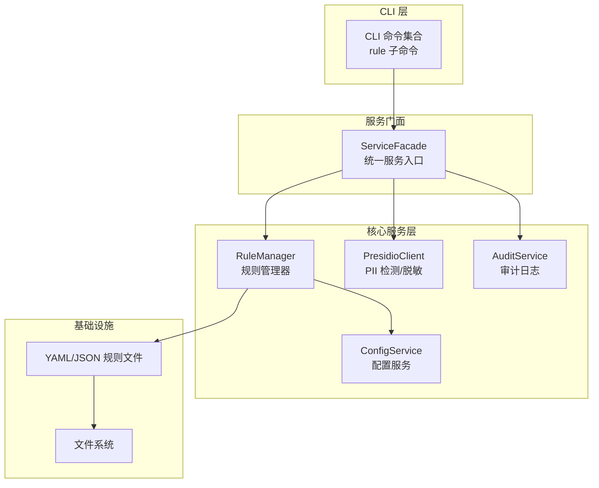
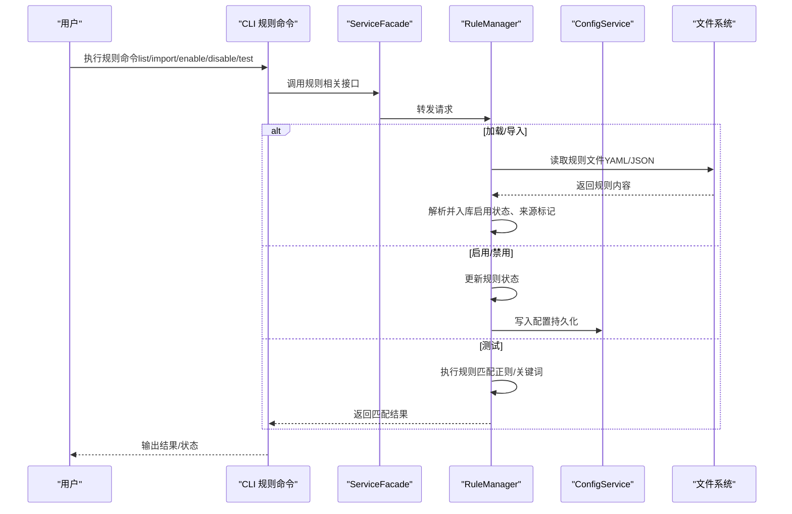
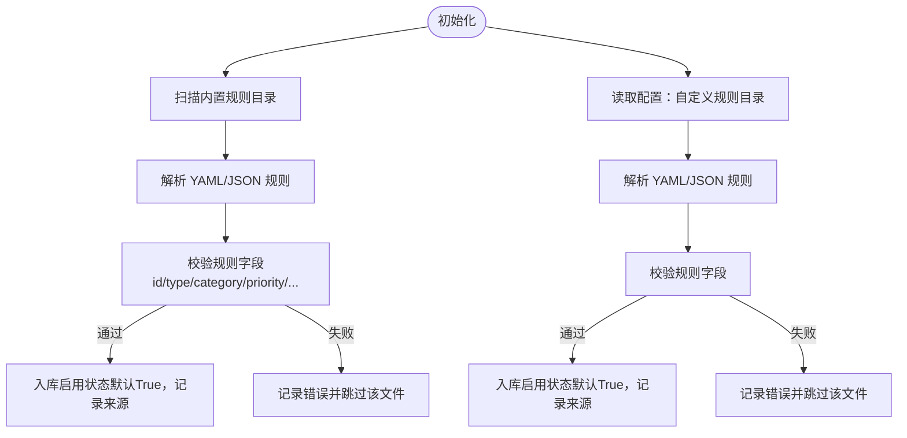
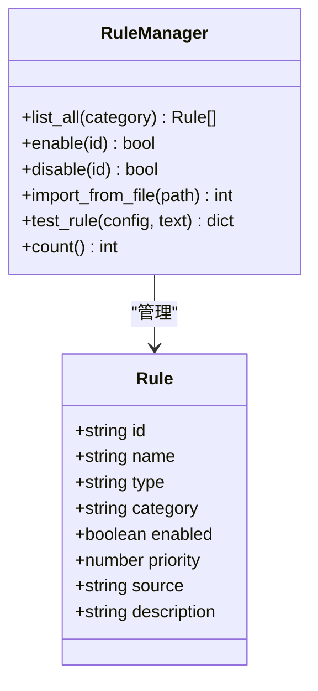
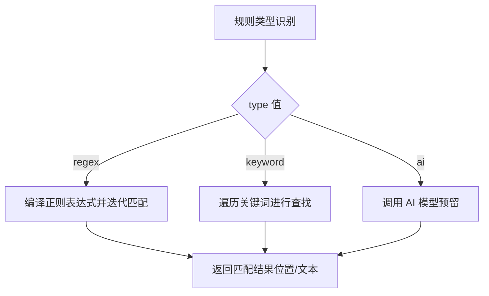
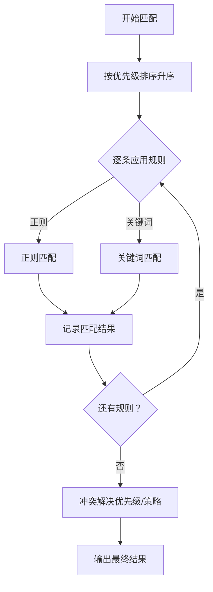
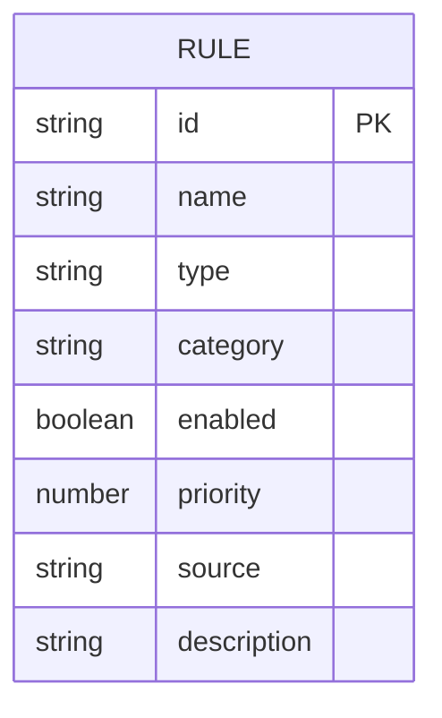
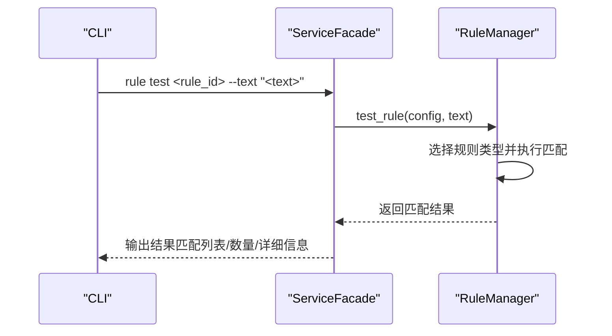
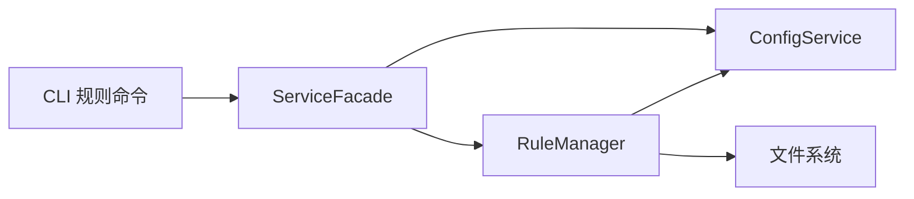

# 规则管理系统

<cite>
**本文档引用的文件**
- [design-update-20260404-v1.0-init.md](file://doc/design/design-update-20260404-v1.0-init.md)
- [05_rule_management.md](file://doc/test/tcs/v1.0/05_rule_management.md)
- [05_rule_management_testdata.md](file://doc/test/tcs/v1.0/05_rule_management_testdata.md)
- [04_pii_detection.md](file://doc/test/tcs/v1.0/04_pii_detection.md)
- [04_pii_detection_testdata.md](file://doc/test/tcs/v1.0/04_pii_detection_testdata.md)
</cite>

## 目录
1. [简介](#简介)
2. [项目结构](#项目结构)
3. [核心组件](#核心组件)
4. [架构总览](#架构总览)
5. [详细组件分析](#详细组件分析)
6. [依赖关系分析](#依赖关系分析)
7. [性能考虑](#性能考虑)
8. [故障排除指南](#故障排除指南)
9. [结论](#结论)
10. [附录](#附录)

## 简介
本文件为 LLM Privacy Gateway 的规则管理系统提供全面的功能文档。围绕规则加载机制、优先级排序与冲突解决策略、内置规则类型（PII 实体规则、自定义正则规则、复合规则）、规则配置语法（YAML/JSON）、规则测试与验证、规则开发与部署流程、规则示例与最佳实践以及规则版本管理与回滚机制进行系统化阐述。文档同时结合黑盒测试用例与测试数据，帮助读者理解规则系统的行为边界与质量保障。

## 项目结构
规则管理系统位于设计文档的模块化架构中，作为核心服务层的一个独立模块存在，CLI 通过统一门面调用规则管理能力。其职责包括：
- 内置规则与自定义规则的加载
- 规则的启用/禁用与批量管理
- 规则导入与测试
- 规则状态与配置的持久化

**图表来源**
- [design-update-20260404-v1.0-init.md:140-568](file://doc/design/design-update-20260404-v1.0-init.md#L140-L568)

**章节来源**
- [design-update-20260404-v1.0-init.md:70-160](file://doc/design/design-update-20260404-v1.0-init.md#L70-L160)

## 核心组件
- 规则管理器（RuleManager）：负责规则的加载、启用/禁用、导入与测试，维护规则内存索引与状态。
- 配置服务（ConfigService）：提供规则相关配置读取（如自定义规则目录）。
- CLI 规则子命令：提供规则列表、启用/禁用、导入、移除、测试、配置查看等命令。
- 审计服务（AuditService）：记录规则相关的操作与状态变更，支撑持久化与回溯。

**章节来源**
- [design-update-20260404-v1.0-init.md:1277-1439](file://doc/design/design-update-20260404-v1.0-init.md#L1277-L1439)
- [05_rule_management.md:1-623](file://doc/test/tcs/v1.0/05_rule_management.md#L1-L623)

## 架构总览
规则系统采用“配置驱动 + 文件加载 + 内存管理”的架构。内置规则默认加载，自定义规则通过配置目录动态加载；规则状态（启用/禁用）与配置变更均持久化到配置文件，重启后恢复。

**图表来源**
- [design-update-20260404-v1.0-init.md:1277-1439](file://doc/design/design-update-20260404-v1.0-init.md#L1277-L1439)
- [05_rule_management.md:41-115](file://doc/test/tcs/v1.0/05_rule_management.md#L41-L115)

**章节来源**
- [design-update-20260404-v1.0-init.md:1277-1439](file://doc/design/design-update-20260404-v1.0-init.md#L1277-L1439)
- [05_rule_management.md:41-115](file://doc/test/tcs/v1.0/05_rule_management.md#L41-L115)

## 详细组件分析

### 规则加载机制
- 内置规则：在规则管理器初始化时扫描内置规则目录，加载 YAML 文件中的规则集合。
- 自定义规则：读取配置中的自定义规则目录，递归加载 YAML 文件。
- 文件格式：支持 YAML 与 JSON；非法格式会触发错误并阻止加载。
- 规则来源标记：每条规则记录包含来源文件路径，便于定位与审计。

**图表来源**
- [design-update-20260404-v1.0-init.md:1306-1339](file://doc/design/design-update-20260404-v1.0-init.md#L1306-L1339)
- [05_rule_management_testdata.md:408-488](file://doc/test/tcs/v1.0/05_rule_management_testdata.md#L408-L488)

**章节来源**
- [design-update-20260404-v1.0-init.md:1306-1339](file://doc/design/design-update-20260404-v1.0-init.md#L1306-L1339)
- [05_rule_management.md:41-115](file://doc/test/tcs/v1.0/05_rule_management.md#L41-L115)

### 规则分类与状态
- 分类：支持 pii、credentials、finance 等分类，亦可自定义分类。
- 状态：enabled/disabled，支持单条与批量启用/禁用。
- 列表筛选：支持按分类、启用/禁用状态筛选。

**图表来源**
- [design-update-20260404-v1.0-init.md:1340-1439](file://doc/design/design-update-20260404-v1.0-init.md#L1340-L1439)
- [05_rule_management.md:135-177](file://doc/test/tcs/v1.0/05_rule_management.md#L135-L177)

**章节来源**
- [05_rule_management.md:601-623](file://doc/test/tcs/v1.0/05_rule_management.md#L601-L623)

### 规则类型与定义
- 正则规则（regex）：基于正则表达式匹配，支持复杂正则与转义。
- 关键词规则（keyword）：基于关键词列表匹配，支持多关键词。
- AI 规则（ai）：预留类型，用于后续扩展。
- 复合规则：通过组合多个规则形成复合检测逻辑（由上层业务或配置驱动）。

**图表来源**
- [05_rule_management_testdata.md:81-112](file://doc/test/tcs/v1.0/05_rule_management_testdata.md#L81-L112)
- [design-update-20260404-v1.0-init.md:1388-1434](file://doc/design/design-update-20260404-v1.0-init.md#L1388-L1434)

**章节来源**
- [05_rule_management_testdata.md:81-112](file://doc/test/tcs/v1.0/05_rule_management_testdata.md#L81-L112)
- [design-update-20260404-v1.0-init.md:1388-1434](file://doc/design/design-update-20260404-v1.0-init.md#L1388-L1434)

### 规则优先级与冲突解决
- 优先级区间：高（1-100）、中（101-200）、低（201-300）。数值越小优先级越高。
- 应用顺序：测试阶段按优先级升序应用，确保高优规则先执行。
- 冲突处理：当多条规则匹配同一内容时，遵循“优先级优先”的策略；若需要更细粒度控制，可在规则层面配置冲突解决策略（例如首次匹配、最长匹配等，由上层业务或配置驱动）。

**图表来源**
- [05_rule_management.md:520-549](file://doc/test/tcs/v1.0/05_rule_management.md#L520-L549)
- [05_rule_management_testdata.md:340-376](file://doc/test/tcs/v1.0/05_rule_management_testdata.md#L340-L376)

**章节来源**
- [05_rule_management.md:616-623](file://doc/test/tcs/v1.0/05_rule_management.md#L616-L623)
- [05_rule_management_testdata.md:340-376](file://doc/test/tcs/v1.0/05_rule_management_testdata.md#L340-L376)

### 规则配置语法（YAML/JSON）
- YAML 格式：rules 数组包含多个规则对象；支持 id、name、type、pattern、category、entity_type、priority、enabled、description 等字段。
- JSON 格式：与 YAML 等价的数据结构。
- 无效格式：语法错误或字段缺失将导致加载失败并记录错误。

**图表来源**
- [05_rule_management_testdata.md:410-441](file://doc/test/tcs/v1.0/05_rule_management_testdata.md#L410-L441)
- [05_rule_management_testdata.md:443-488](file://doc/test/tcs/v1.0/05_rule_management_testdata.md#L443-L488)

**章节来源**
- [05_rule_management_testdata.md:408-488](file://doc/test/tcs/v1.0/05_rule_management_testdata.md#L408-L488)

### 规则测试与验证
- 单条规则测试：支持对指定规则进行匹配测试，返回匹配位置、文本与数量。
- 多规则测试：支持对文本进行全量规则匹配，按优先级输出结果。
- 详细结果：支持详细模式输出匹配详情与处理建议。
- 错误处理：无效规则（如正则编译失败）会返回错误信息。

**图表来源**
- [05_rule_management.md:411-470](file://doc/test/tcs/v1.0/05_rule_management.md#L411-L470)
- [design-update-20260404-v1.0-init.md:1388-1434](file://doc/design/design-update-20260404-v1.0-init.md#L1388-L1434)

**章节来源**
- [05_rule_management.md:411-470](file://doc/test/tcs/v1.0/05_rule_management.md#L411-L470)

### 规则开发指南
- 编写规则：在 YAML/JSON 中定义规则字段，选择合适类型（regex/keyword/ai），设置分类与优先级。
- 调试技巧：先在测试命令中验证匹配效果，逐步优化正则或关键词列表。
- 部署流程：将规则文件放入内置或自定义目录，或通过导入命令添加；确认加载日志与规则列表。
- 最佳实践：
  - 为规则提供清晰的描述与分类
  - 合理设置优先级，避免低优先级规则覆盖高优先级规则
  - 使用关键词规则补充正则规则的不足
  - 对复杂正则进行单元测试与回归测试

**章节来源**
- [05_rule_management.md:41-115](file://doc/test/tcs/v1.0/05_rule_management.md#L41-L115)
- [05_rule_management_testdata.md:408-488](file://doc/test/tcs/v1.0/05_rule_management_testdata.md#L408-L488)

### 规则示例与最佳实践
- PII 检测示例：结合 PII 检测模块，规则可用于增强或定制检测能力（如特定行业术语、格式变体）。
- 脱敏策略：规则可与 Presidio 的脱敏策略协同，实现更精细的脱敏控制。
- 复合场景：在金融、医疗等高敏感领域，建议采用“正则 + 关键词 + AI”复合规则，提升召回与精度。

**章节来源**
- [04_pii_detection.md:1-717](file://doc/test/tcs/v1.0/04_pii_detection.md#L1-L717)
- [04_pii_detection_testdata.md:1-457](file://doc/test/tcs/v1.0/04_pii_detection_testdata.md#L1-L457)

### 规则版本管理与回滚
- 持久化策略：规则状态与配置变更写入配置文件，重启后自动恢复。
- 回滚建议：
  - 在导入新规则前备份配置文件
  - 通过禁用/移除逐步回退，避免一次性大规模变更
  - 使用测试命令验证变更影响后再批量启用

**章节来源**
- [05_rule_management.md:552-581](file://doc/test/tcs/v1.0/05_rule_management.md#L552-L581)

## 依赖关系分析
规则管理器依赖配置服务读取自定义规则目录，依赖文件系统加载规则文件；CLI 通过服务门面间接依赖规则管理器。整体耦合度低，便于扩展与测试。

**图表来源**
- [design-update-20260404-v1.0-init.md:1277-1439](file://doc/design/design-update-20260404-v1.0-init.md#L1277-L1439)

**章节来源**
- [design-update-20260404-v1.0-init.md:1277-1439](file://doc/design/design-update-20260404-v1.0-init.md#L1277-L1439)

## 性能考虑
- 规则加载：建议将规则文件拆分为较小的 YAML/JSON 文件，避免单文件过大导致解析开销。
- 匹配效率：正则规则应避免回溯陷阱；关键词规则建议预处理为高效数据结构（如前缀树）。
- 并发处理：规则测试与匹配应在单线程上下文中进行，避免共享状态竞争。
- 日志与审计：规则状态变更与测试结果应写入审计日志，便于性能分析与问题追踪。

[本节为通用指导，无需引用具体文件]

## 故障排除指南
- 规则未加载：检查规则文件格式与字段完整性；查看加载日志。
- 规则不生效：确认规则状态为启用；检查优先级与冲突处理策略。
- 正则错误：修正正则语法，避免无效转义或未闭合结构。
- 导入失败：确认文件存在且格式正确；检查权限与路径。

**章节来源**
- [05_rule_management.md:103-115](file://doc/test/tcs/v1.0/05_rule_management.md#L103-L115)
- [05_rule_management_testdata.md:443-488](file://doc/test/tcs/v1.0/05_rule_management_testdata.md#L443-L488)

## 结论
规则管理系统以“配置驱动 + 文件加载 + 内存管理”为核心，提供了完善的规则生命周期管理能力。通过明确的分类、状态与优先级机制，结合严格的测试与验证流程，能够满足多样化的隐私保护需求。建议在生产环境中配合审计日志与版本管理策略，确保规则的稳定性与可追溯性。

[本节为总结性内容，无需引用具体文件]

## 附录
- CLI 命令参考：列出、按分类/状态筛选、启用/禁用、导入、移除、测试、查看配置等。
- 规则分类与状态：pii、credentials、finance 等分类及 enabled/disabled 状态说明。
- 优先级区间：高（1-100）、中（101-200）、低（201-300）。

**章节来源**
- [05_rule_management.md:586-623](file://doc/test/tcs/v1.0/05_rule_management.md#L586-L623)