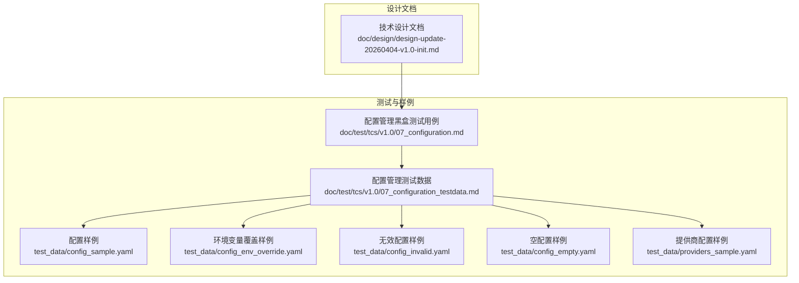
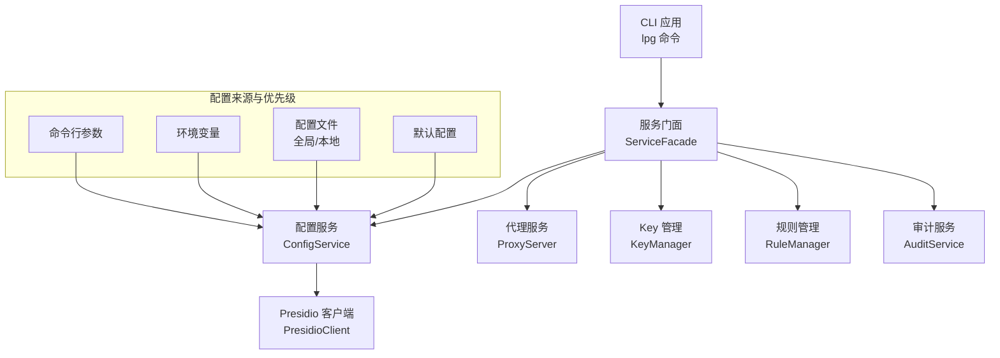
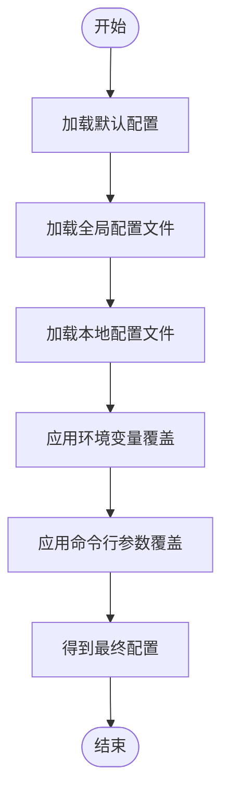
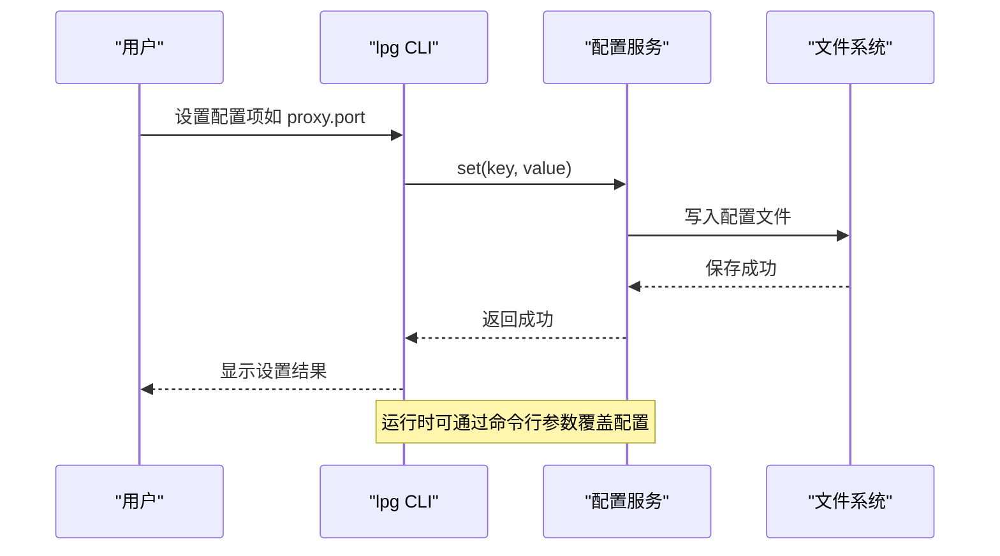
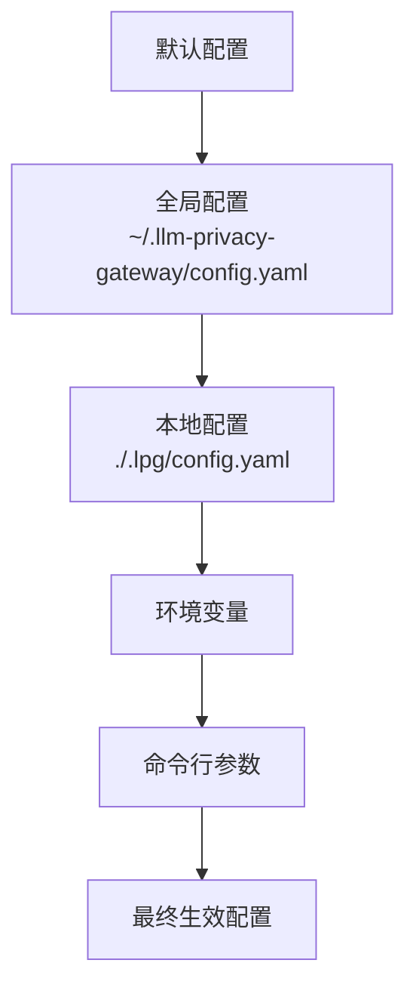
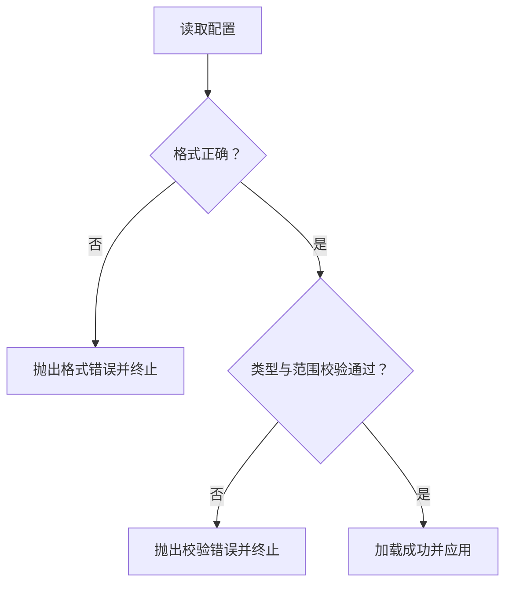
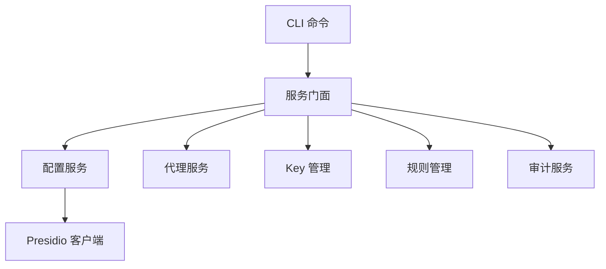

# 配置管理系统

<cite>
**本文引用的文件**
- [配置管理黑盒测试用例](file://doc/test/tcs/v1.0/07_configuration.md)
- [配置管理测试数据](file://doc/test/tcs/v1.0/07_configuration_testdata.md)
- [配置样例](file://doc/test/tcs/v1.0/test_data/config_sample.yaml)
- [环境变量覆盖样例](file://doc/test/tcs/v1.0/test_data/config_env_override.yaml)
- [无效配置样例](file://doc/test/tcs/v1.0/test_data/config_invalid.yaml)
- [空配置样例](file://doc/test/tcs/v1.0/test_data/config_empty.yaml)
- [提供商配置样例](file://doc/test/tcs/v1.0/test_data/providers_sample.yaml)
- [技术设计文档](file://doc/design/design-update-20260404-v1.0-init.md)
</cite>

## 目录
1. [简介](#简介)
2. [项目结构](#项目结构)
3. [核心组件](#核心组件)
4. [架构总览](#架构总览)
5. [详细组件分析](#详细组件分析)
6. [依赖关系分析](#依赖关系分析)
7. [性能考量](#性能考量)
8. [故障排查指南](#故障排查指南)
9. [结论](#结论)
10. [附录](#附录)

## 简介
本文件面向 LLM Privacy Gateway 的配置管理系统，提供从配置层次与优先级、配置项语义与取值范围、动态更新机制、完整配置示例到验证与错误处理、最佳实践与安全建议的全景式使用文档。读者可据此在不同环境中正确配置系统参数，并在不重启服务的前提下完成配置变更。

## 项目结构
围绕配置管理的相关资料主要分布在测试用例与测试数据中，形成“测试驱动”的配置规范说明：
- 测试用例文档：定义配置初始化、加载、读取、设置、验证、环境变量覆盖、优先级、持久化、提供商配置等行为
- 测试数据文档：给出默认配置、全局/本地配置、环境变量、命令行参数的合并示例及边界条件
- 配置样例文件：提供实际可参考的 YAML 配置片段
- 技术设计文档：说明 CLI 与服务门面对配置的调用关系，为理解配置生效路径提供依据

**图表来源**
- [配置管理黑盒测试用例:1-594](file://doc/test/tcs/v1.0/07_configuration.md#L1-L594)
- [配置管理测试数据:1-808](file://doc/test/tcs/v1.0/07_configuration_testdata.md#L1-L808)
- [配置样例:1-27](file://doc/test/tcs/v1.0/test_data/config_sample.yaml#L1-L27)
- [环境变量覆盖样例:1-16](file://doc/test/tcs/v1.0/test_data/config_env_override.yaml#L1-L16)
- [无效配置样例:1-29](file://doc/test/tcs/v1.0/test_data/config_invalid.yaml#L1-L29)
- [空配置样例:1-1](file://doc/test/tcs/v1.0/test_data/config_empty.yaml#L1-L1)
- [提供商配置样例:1-25](file://doc/test/tcs/v1.0/test_data/providers_sample.yaml#L1-L25)
- [技术设计文档:1-2595](file://doc/design/design-update-20260404-v1.0-init.md#L1-L2595)

**章节来源**
- [配置管理黑盒测试用例:1-594](file://doc/test/tcs/v1.0/07_configuration.md#L1-L594)
- [配置管理测试数据:1-808](file://doc/test/tcs/v1.0/07_configuration_testdata.md#L1-L808)
- [技术设计文档:1-2595](file://doc/design/design-update-20260404-v1.0-init.md#L1-L2595)

## 核心组件
- 配置初始化与持久化：支持交互式与非交互式初始化；支持指定输出路径与强制覆盖；修改后自动保存
- 配置加载与读取：支持从默认路径与指定路径加载；支持读取单个或嵌套配置项；支持带默认值读取
- 配置设置与验证：支持设置单个或嵌套配置项；内置范围与格式校验（端口、超时、日志级别、URL、布尔值等）
- 环境变量覆盖与优先级：支持通过环境变量覆盖配置；明确命令行参数 > 环境变量 > 配置文件的优先级
- 提供商配置管理：支持添加、移除、更新、列出提供商；支持多种认证类型与基础 URL
- 动态更新机制：测试用例表明配置修改后会持久化并影响后续读取；结合服务门面与代理服务的启动参数，可在不重启服务的前提下通过命令行参数覆盖运行时行为

**章节来源**
- [配置管理黑盒测试用例:37-594](file://doc/test/tcs/v1.0/07_configuration.md#L37-L594)
- [配置管理测试数据:592-745](file://doc/test/tcs/v1.0/07_configuration_testdata.md#L592-L745)
- [技术设计文档:411-568](file://doc/design/design-update-20260404-v1.0-init.md#L411-L568)

## 架构总览
下图展示了 CLI、服务门面与配置服务之间的交互关系，以及配置在启动时如何被读取与应用：

**图表来源**
- [技术设计文档:280-568](file://doc/design/design-update-20260404-v1.0-init.md#L280-L568)
- [配置管理黑盒测试用例:454-498](file://doc/test/tcs/v1.0/07_configuration.md#L454-L498)

**章节来源**
- [技术设计文档:280-568](file://doc/design/design-update-20260404-v1.0-init.md#L280-L568)
- [配置管理黑盒测试用例:454-498](file://doc/test/tcs/v1.0/07_configuration.md#L454-L498)

## 详细组件分析

### 配置层次与优先级机制
- 层次结构
  - 默认配置：系统内置的默认值集合
  - 全局配置：用户主目录下的默认配置文件
  - 本地配置：项目根目录下的本地配置文件
  - 环境变量：以特定前缀命名的环境变量
  - 命令行参数：启动服务时传入的参数
- 优先级顺序（从高到低）
  - 命令行参数 > 环境变量 > 本地配置 > 全局配置 > 默认配置
- 合并策略
  - 命令行参数覆盖环境变量与配置文件
  - 环境变量覆盖配置文件
  - 本地配置覆盖全局配置
  - 全局配置覆盖默认配置
  - 空配置文件或缺失配置时回退到默认配置

**图表来源**
- [配置管理测试数据:594-745](file://doc/test/tcs/v1.0/07_configuration_testdata.md#L594-L745)

**章节来源**
- [配置管理测试数据:594-745](file://doc/test/tcs/v1.0/07_configuration_testdata.md#L594-L745)
- [配置管理黑盒测试用例:454-498](file://doc/test/tcs/v1.0/07_configuration.md#L454-L498)

### 配置项与取值范围
以下为常见配置项及其取值范围与约束（基于测试数据与用例总结）：
- 代理服务器
  - proxy.host：有效 IPv4 地址、localhost 或有效域名；不允许非法主机名
  - proxy.port：1-65535 的整数；不允许 0、负数、超出范围或非数字
  - proxy.timeout：>0 的整数或浮点数（秒）；不允许 0、负数、超出范围或非数字
  - proxy.max_connections：>0 的整数；不允许 0、负数、超出范围或非数字
- Presidio（PII 检测）
  - presidio.endpoint：HTTP/HTTPS URL；必须包含协议与完整主机/端口
  - presidio.language：ISO 639-1 语言代码（小写）
  - presidio.enabled：布尔值（true/false）
  - presidio.timeout：>0 的整数（秒）
- 日志系统
  - log.level：debug/info/warn/error/critical（小写）
  - log.file：合法文件路径；需可写
  - log.max_size：带单位的大小（如 MB/GB），需带单位且数值>0
  - log.max_files：>0 的整数；过大或过小均会报错
  - log.format：json/text/structured（小写）
- 审计日志
  - audit.enabled：布尔值
  - audit.log_file：合法文件路径
  - audit.retention_days：>0 的整数；过大或过小均会报错
- 规则管理
  - rules.enabled_categories：至少包含一个有效类别；不允许空数组或无效类别
  - rules.custom_rules_dir：合法目录路径
- 虚拟 Key
  - virtual_keys[].id/name/provider：字符串；id 不允许空、空格、特殊字符过多；name 不允许空或超长
  - virtual_keys[].permissions：键值结构；不允许无效键、负数或空列表
  - virtual_keys[].expires_at：日期或相对时间格式
- 提供商配置
  - providers[].name/type/base_url：name/type 有白名单；base_url 必须为 HTTP/HTTPS 且完整
  - providers[].auth_type：支持 bearer/x-api-key/api-key/basic
  - providers[].api_key_file：合法文件路径

**章节来源**
- [配置管理测试数据:25-780](file://doc/test/tcs/v1.0/07_configuration_testdata.md#L25-L780)
- [配置管理黑盒测试用例:330-451](file://doc/test/tcs/v1.0/07_configuration.md#L330-L451)

### 动态配置更新机制
- 配置持久化：设置配置项后会自动保存到配置文件，后续读取将反映最新值
- 运行时覆盖：命令行参数具有最高优先级，可在启动时覆盖环境变量与配置文件
- 交互与非交互初始化：支持交互式与非交互式初始化，默认输出路径与强制覆盖行为明确
- 提供商配置动态维护：支持添加、移除、更新、列出提供商，配置文件随之更新

**图表来源**
- [配置管理黑盒测试用例:253-327](file://doc/test/tcs/v1.0/07_configuration.md#L253-L327)
- [配置管理测试数据:594-745](file://doc/test/tcs/v1.0/07_configuration_testdata.md#L594-L745)

**章节来源**
- [配置管理黑盒测试用例:253-327](file://doc/test/tcs/v1.0/07_configuration.md#L253-L327)
- [配置管理测试数据:594-745](file://doc/test/tcs/v1.0/07_configuration_testdata.md#L594-L745)

### 完整配置示例
- 默认配置：包含代理、Presidio、日志、提供商、虚拟 Key、规则、脱敏、审计等字段的默认值
- 全局配置：用户主目录下的配置文件，覆盖默认配置的部分字段
- 本地配置：项目根目录下的配置文件，覆盖全局配置的部分字段
- 环境变量：以特定前缀命名的环境变量，覆盖配置文件对应字段
- 命令行参数：启动服务时传入的参数，覆盖环境变量与配置文件

**图表来源**
- [配置管理测试数据:594-745](file://doc/test/tcs/v1.0/07_configuration_testdata.md#L594-L745)

**章节来源**
- [配置管理测试数据:594-745](file://doc/test/tcs/v1.0/07_configuration_testdata.md#L594-L745)

### 配置验证与错误处理
- 格式错误：YAML 语法错误、包含 tab 缩进、重复键等
- 类型错误：端口/超时/连接数为字符串、布尔值为字符串、数组为字符串等
- 边界条件：端口越界、超时为 0、日志大小/文件数越界、保留天数越界、路径不存在/无权限等
- 环境变量无效：当环境变量值不符合预期时，系统会发出警告并回退到配置文件值

**图表来源**
- [配置管理测试数据:747-780](file://doc/test/tcs/v1.0/07_configuration_testdata.md#L747-L780)
- [配置管理黑盒测试用例:146-173](file://doc/test/tcs/v1.0/07_configuration.md#L146-L173)

**章节来源**
- [配置管理测试数据:747-780](file://doc/test/tcs/v1.0/07_configuration_testdata.md#L747-L780)
- [配置管理黑盒测试用例:146-173](file://doc/test/tcs/v1.0/07_configuration.md#L146-L173)

### 最佳实践与安全建议
- 配置文件权限：确保配置文件权限严格（例如仅属主可读写），避免泄露敏感信息
- 环境变量隔离：在容器或 CI/CD 环境中使用环境变量进行覆盖，避免硬编码在配置文件中
- 命令行参数最小化：仅在启动时覆盖必要的运行时参数，日常维护通过配置文件与提供商管理命令完成
- 提供商密钥管理：优先使用 api_key_file 或安全存储，避免直接在配置文件中明文存放
- 审计与日志：开启审计日志并合理设置保留期；日志轮转参数按容量与文件数上限配置
- 规则与脱敏：启用必要的规则类别，谨慎配置脱敏策略与恢复能力

**章节来源**
- [配置管理测试数据:167-262](file://doc/test/tcs/v1.0/07_configuration_testdata.md#L167-L262)
- [配置管理黑盒测试用例:518-530](file://doc/test/tcs/v1.0/07_configuration.md#L518-L530)

## 依赖关系分析
- CLI 通过服务门面访问配置服务，配置服务负责加载与合并配置源
- 代理服务在启动时读取配置，命令行参数可覆盖配置
- 提供商配置直接影响 Key 管理与 Presidio 客户端的行为
- 审计服务依赖日志配置与审计开关

**图表来源**
- [技术设计文档:411-568](file://doc/design/design-update-20260404-v1.0-init.md#L411-L568)

**章节来源**
- [技术设计文档:411-568](file://doc/design/design-update-20260404-v1.0-init.md#L411-L568)

## 性能考量
- 配置加载：建议将配置文件放置在本地磁盘，避免远程挂载导致的延迟
- 日志轮转：合理设置日志文件大小与备份数量，避免磁盘 IO 峰值
- 连接数与超时：根据业务负载调整最大连接数与超时，避免资源耗尽或请求堆积
- 环境变量覆盖：在容器编排中尽量减少频繁变更，降低启动时的配置解析开销

## 故障排查指南
- 配置文件不存在：检查默认路径与指定路径是否存在；使用初始化命令生成配置
- 配置文件格式错误：修复 YAML 语法（禁止 tab 缩进、重复键等）；使用 JSON/YAML 校验工具辅助
- 端口冲突：确认端口在 1-65535 范围内且未被占用；必要时切换端口
- 路径无权限：检查文件/目录权限；确保日志与密钥文件所在目录可写
- 环境变量无效：确认环境变量值符合类型与范围；系统会回退到配置文件值
- 提供商连接失败：检查 base_url、认证类型与密钥文件路径；使用提供商测试命令验证连通性

**章节来源**
- [配置管理黑盒测试用例:131-173](file://doc/test/tcs/v1.0/07_configuration.md#L131-L173)
- [配置管理测试数据:15-24](file://doc/test/tcs/v1.0/07_configuration_testdata.md#L15-L24)

## 结论
本配置管理系统通过清晰的层次与优先级机制、完善的验证与错误处理、以及动态更新能力，为 LLM Privacy Gateway 的部署与运维提供了灵活而可靠的支撑。遵循本文的最佳实践与安全建议，可在不同环境中稳定地配置与运行系统。

## 附录
- 配置样例文件路径
  - [配置样例:1-27](file://doc/test/tcs/v1.0/test_data/config_sample.yaml#L1-L27)
  - [环境变量覆盖样例:1-16](file://doc/test/tcs/v1.0/test_data/config_env_override.yaml#L1-L16)
  - [无效配置样例:1-29](file://doc/test/tcs/v1.0/test_data/config_invalid.yaml#L1-L29)
  - [空配置样例:1-1](file://doc/test/tcs/v1.0/test_data/config_empty.yaml#L1-L1)
  - [提供商配置样例:1-25](file://doc/test/tcs/v1.0/test_data/providers_sample.yaml#L1-L25)
- 测试用例与测试数据
  - [配置管理黑盒测试用例:1-594](file://doc/test/tcs/v1.0/07_configuration.md#L1-L594)
  - [配置管理测试数据:1-808](file://doc/test/tcs/v1.0/07_configuration_testdata.md#L1-L808)
- 技术设计参考
  - [技术设计文档:1-2595](file://doc/design/design-update-20260404-v1.0-init.md#L1-L2595)