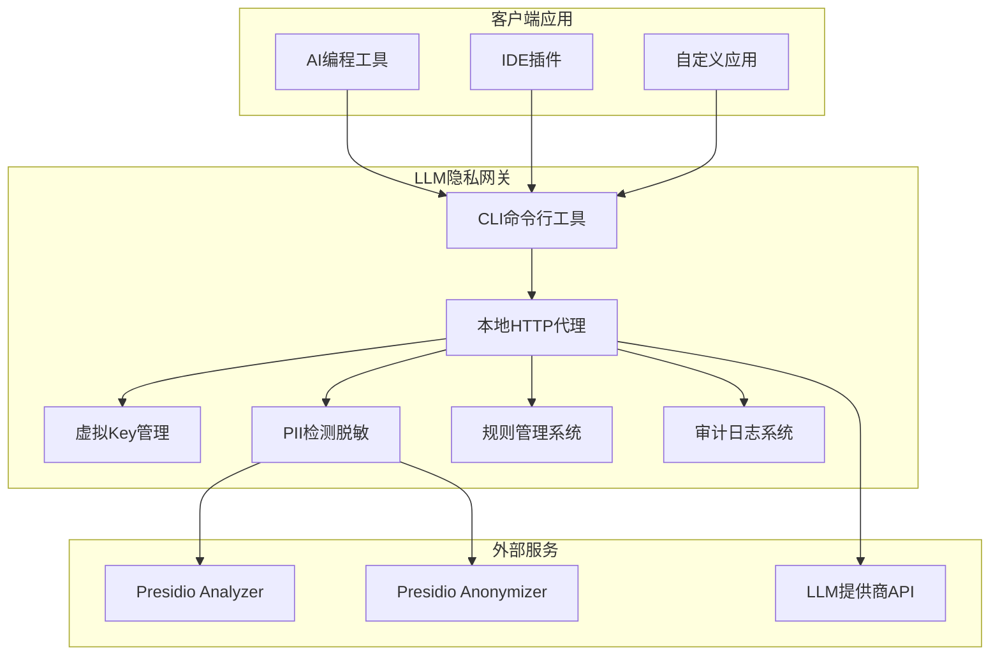
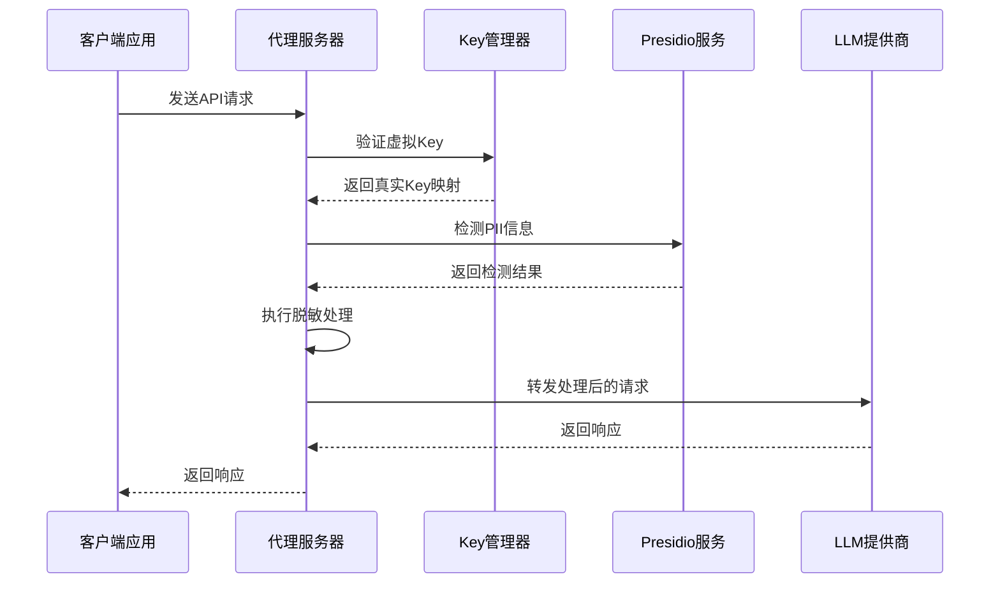
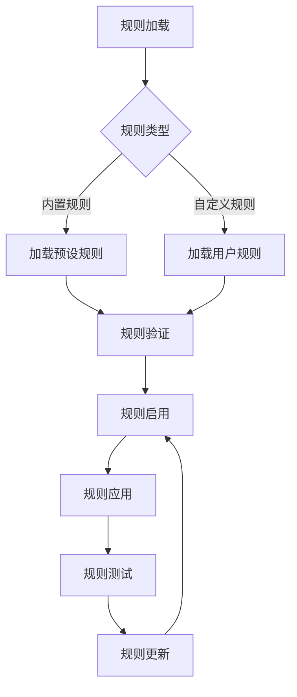

# 项目介绍

<cite>
**本文档引用的文件**
- [AGENTS.md](file://AGENTS.md)
- [design-update-20260404-v1.0-init.md](file://doc/design/design-update-20260404-v1.0-init.md)
- [req-init-20260401.md](file://doc/req/req-init-20260401.md)
- [01_cli_commands.md](file://doc/test/tcs/v1.0/01_cli_commands.md)
- [02_proxy_service.md](file://doc/test/tcs/v1.0/02_proxy_service.md)
- [03_key_management.md](file://doc/test/tcs/v1.0/03_key_management.md)
- [04_pii_detection.md](file://doc/test/tcs/v1.0/04_pii_detection.md)
- [05_rule_management.md](file://doc/test/tcs/v1.0/05_rule_management.md)
- [06_audit_logging.md](file://doc/test/tcs/v1.0/06_audit_logging.md)
- [README.md](file://doc/test/tcs/v1.0/README.md)
</cite>

## 目录
1. [项目概述](#项目概述)
2. [核心价值主张](#核心价值主张)
3. [目标用户群体](#目标用户群体)
4. [独特定位与技术特色](#独特定位与技术特色)
5. [解决的核心问题](#解决的核心问题)
6. [主要应用场景](#主要应用场景)
7. [技术架构概览](#技术架构概览)
8. [关键功能模块](#关键功能模块)
9. [测试覆盖与质量保证](#测试覆盖与质量保证)
10. [项目发展路线](#项目发展路线)
11. [结语](#结语)

## 项目概述

LLM Privacy Gateway（LLM隐私网关）是一个专注于AI应用隐私保护的本地化解决方案。该项目旨在为开发者和企业提供一个完全本地化的隐私保护代理，通过虚拟Key管理和智能PII检测技术，在请求发送到LLM提供商之前自动识别和脱敏敏感信息。

项目采用CLI优先的MVP策略，当前版本v1.0提供了完整的隐私保护代理功能，包括本地HTTP代理、虚拟Key管理、PII检测脱敏、规则管理、审计日志等核心能力。通过与微软Presidio项目的深度集成，项目实现了业界领先的个人身份信息（PII）识别和脱敏能力。

## 核心价值主张

### 本地化隐私保护
- **完全本地化处理**：所有敏感数据检测和脱敏在本地完成，消除云端信任风险
- **零数据泄露**：敏感信息不会离开用户的本地环境
- **合规性保障**：满足GDPR、数据本地化等法规要求

### 透明代理体验
- **虚拟Key机制**：通过虚拟API Key实现无缝集成，无需修改现有应用配置
- **OpenAI API兼容**：支持/v1/chat/completions、/v1/completions、/v1/embeddings等标准端点
- **流式响应支持**：完整支持SSE（Server-Sent Events）流式处理

### 智能识别能力
- **多技术融合**：结合NER、正则表达式、规则逻辑、校验和验证等多种识别技术
- **上下文感知**：能够理解不同上下文中的敏感信息
- **多语言支持**：支持中文、英文等多种语言的PII识别

## 目标用户群体

### 企业开发者
- 在企业环境中使用AI编程工具的开发团队
- 需要保护代码资产和知识产权的软件公司
- 对数据安全有严格要求的企业级应用

### 个人开发者
- 使用AI辅助编程的自由职业者
- 需要保护个人项目隐私的开发者
- 注重API Key安全性的独立开发者

### 安全与合规团队
- 负责企业数据安全的专业人员
- 需要审计追踪功能的安全团队
- 负责合规管理的法务人员

## 独特定位与技术特色

### CLI优先的本地代理服务
项目采用CLI优先策略，提供跨平台的本地代理服务，具有以下优势：
- **快速部署**：无需复杂的GUI界面，快速启动和配置
- **跨平台兼容**：支持macOS、Linux、Windows操作系统
- **自动化友好**：易于集成到CI/CD流程和自动化脚本中
- **资源占用低**：适合在开发者的本地机器上长期运行

### 虚拟Key管理机制
通过虚拟Key技术实现透明的隐私保护：
- **Key生成与映射**：生成格式为`sk-virtual-xxxxxx`的虚拟Key，与真实Key建立一对一映射
- **权限控制**：可配置虚拟Key的权限范围（模型、端点限制）
- **生命周期管理**：支持设置过期时间，支持手动吊销
- **使用统计**：记录每个虚拟Key的使用次数和时间

### 智能PII检测与脱敏
基于微软Presidio构建的核心能力：
- **多实体类型识别**：支持EMAIL_ADDRESS、PHONE_NUMBER、CREDIT_CARD、PERSON等实体类型
- **多种脱敏策略**：replace、mask、redact、hash、encrypt等多种脱敏操作
- **上下文感知**：根据不同内容类型采用相应的脱敏策略
- **可扩展识别器**：支持自定义识别器扩展检测能力

### 审计日志系统
完整的审计追踪功能：
- **详细日志记录**：记录请求处理的每个环节
- **查询与统计**：支持按时间范围、日志级别、关键词等条件查询
- **导出功能**：支持将日志导出为JSON格式
- **性能监控**：记录请求耗时、成功率等关键指标

## 解决的核心问题

### 敏感数据泄露风险
现代AI应用在使用过程中会将大量数据发送到LLM服务提供商，存在严重的隐私风险：
- **API Key泄露**：代码中的API Key可能被意外传输到云端
- **个人信息泄露**：用户个人信息、项目代号等敏感信息可能被暴露
- **商业机密泄露**：代码片段、架构设计等商业机密可能外泄

### 合规性挑战
企业需要遵守GDPR、数据本地化等法规，对数据处理有严格要求：
- **数据主权**：确保数据在境内处理，满足数据本地化要求
- **隐私保护**：符合个人信息保护相关法规
- **审计追踪**：提供完整的数据处理记录

### 现有方案局限性
传统的隐私保护方案存在明显不足：
- **云端代理方案**：存在信任问题，数据需要传输到第三方
- **网络层代理**：缺乏智能识别能力，配置复杂
- **LLM内置安全**：覆盖有限，不可自定义

## 主要应用场景

### 企业合规要求
- **金融行业**：保护客户个人信息、交易记录等敏感数据
- **医疗健康**：满足HIPAA等医疗数据保护法规
- **法律合规**：保护案件信息、客户资料等机密内容
- **政府机构**：满足政务数据安全和保密要求

### 开发者隐私保护
- **AI编程工具**：保护代码片段、项目配置等开发数据
- **个人项目**：保护个人项目的源代码和配置信息
- **API Key管理**：防止API Key在传输过程中的泄露

### 多租户环境下的数据隔离
- **SaaS平台**：为不同客户提供数据隔离保护
- **开发测试环境**：确保测试数据与生产数据的分离
- **团队协作**：保护团队间的敏感信息共享

## 技术架构概览

**架构图来源**
- [design-update-20260404-v1.0-init.md:70-122](file://doc/design/design-update-20260404-v1.0-init.md#L70-L122)

### 核心组件关系

项目采用分层架构设计，各组件职责明确：

**CLI层**：提供命令行接口，支持服务启动、配置管理、规则管理等功能
**代理服务层**：实现HTTP代理功能，处理请求拦截、转发、流式响应等
**核心业务层**：包含虚拟Key管理、PII检测、规则管理等核心业务逻辑
**基础设施层**：提供配置管理、审计日志、Presidio服务集成等基础设施

## 关键功能模块

### 代理服务模块
代理服务是项目的核心功能，提供完整的HTTP代理能力：

**序列图来源**
- [design-update-20260404-v1.0-init.md:164-250](file://doc/design/design-update-20260404-v1.0-init.md#L164-L250)

### 虚拟Key管理模块
虚拟Key管理提供完整的Key生命周期管理：

| 功能特性 | 详细说明 |
|----------|----------|
| Key生成 | 生成格式为`sk-virtual-xxxxxx`的虚拟Key |
| Key映射 | 建立虚拟Key与真实Key的一对一映射关系 |
| 权限控制 | 支持设置API Key的权限范围（模型、端点限制） |
| 生命周期管理 | 支持设置过期时间，支持手动吊销 |
| 使用统计 | 记录每个虚拟Key的使用次数和时间 |

### PII检测与脱敏模块
基于Presidio构建的智能检测能力：

| PII实体类型 | 默认脱敏策略 | 适用场景 |
|-------------|--------------|----------|
| EMAIL_ADDRESS | mask | 邮箱地址脱敏 |
| PHONE_NUMBER | replace | 电话号码脱敏 |
| CREDIT_CARD | mask | 信用卡号脱敏 |
| PERSON | replace | 人名脱敏 |
| CN_ID_CARD | replace | 身份证号脱敏 |
| IP_ADDRESS | replace | IP地址脱敏 |
| URL | mask | URL地址脱敏 |

### 规则管理模块
灵活的规则管理系统：

**流程图来源**
- [05_rule_management.md:41-85](file://doc/test/tcs/v1.0/05_rule_management.md#L41-L85)

## 测试覆盖与质量保证

### 测试体系结构
项目建立了完善的测试体系，确保功能质量和稳定性：

| 测试类型 | 测试模块 | 测试用例数 | 通过标准 |
|----------|----------|------------|----------|
| CLI命令测试 | CLI命令行功能 | 41个 | ✅ 完成 |
| 代理服务测试 | 代理服务器功能 | 32个 | ✅ 完成 |
| Key管理测试 | Key管理功能 | 28个 | ✅ 完成 |
| PII检测测试 | PII检测脱敏功能 | 42个 | ✅ 完成 |
| 规则管理测试 | 规则管理功能 | 35个 | ✅ 完成 |
| 审计日志测试 | 审计日志功能 | 30个 | ✅ 完成 |
| 配置管理测试 | 配置管理功能 | 36个 | ✅ 完成 |
| 端到端测试 | 系统集成测试 | 26个 | ✅ 完成 |

### 质量指标
项目制定了严格的质量指标：

| 指标类别 | 具体指标 | 目标值 |
|----------|----------|--------|
| 性能指标 | 代理转发延迟（P99） | < 50ms |
| 性能指标 | 脱敏处理延迟（P99） | < 100ms |
| 性能指标 | 内存占用（空闲状态） | < 200MB |
| 质量指标 | 敏感信息识别准确率 | > 95% |
| 质量指标 | 误报率 | < 5% |
| 用户指标 | 首次启动成功率 | > 95% |

### 测试数据覆盖
项目提供了丰富的测试数据，确保测试的全面性：

- **CLI命令测试数据**：~196条，覆盖率达到≥95%
- **代理服务测试数据**：~150条，覆盖率达到≥95%
- **Key管理测试数据**：~120条，覆盖率达到≥95%
- **PII检测测试数据**：~200条，覆盖率达到≥95%
- **规则管理测试数据**：~100条，覆盖率达到≥95%
- **审计日志测试数据**：~150条，覆盖率达到≥95%
- **配置管理测试数据**：~130条，覆盖率达到≥95%
- **端到端集成测试数据**：~180条，覆盖率达到≥95%

## 项目发展路线

### v1.0 (MVP) - CLI版本
**当前阶段**，专注于提供核心隐私保护功能：

**核心功能**：
- CLI命令行工具（跨平台支持）
- 核心代理功能（本地HTTP代理）
- 基础PII检测规则（基于Presidio）
- 虚拟Key管理（配置文件方式）
- 基础审计日志（文件输出）
- 规则库本地管理

**技术特点**：
- CLI优先策略，快速迭代
- 跨平台兼容性
- 自动化友好
- 技术验证核心架构

### v1.1 - v1.3 (CLI增强版)
**功能增强**，重点提升用户体验和功能完整性：

**商业化核心功能**：
- 规则库订阅服务
- 多领域规则包（医疗、金融、法律等）
- 规则自动更新机制
- 交互式配置向导
- 丰富的命令输出与状态展示
- 性能监控命令

### v2.0 (GUI版本)
**GUI版本**，提供原生桌面应用体验：

**核心功能**：
- macOS原生应用（SwiftUI）
- 菜单栏常驻应用
- 可视化配置界面
- 实时监控仪表盘
- 规则市场图形化界面

### v2.5+ (企业版)
**企业级功能**，满足大型组织的复杂需求：

**高级功能**：
- 团队协作版
- 企业级规则定制服务
- 浏览器扩展
- Windows/Linux GUI版本
- 企业级功能（SIEM集成、合规报告）

## 结语

LLM Privacy Gateway项目通过技术创新和精心设计，为企业和个人开发者提供了一个完全本地化的隐私保护解决方案。项目采用CLI优先策略，快速验证了核心架构和技术可行性，为后续的GUI版本和企业级功能奠定了坚实基础。

通过虚拟Key管理、智能PII检测、规则管理、审计日志等核心功能，项目有效解决了AI应用中的隐私保护难题，满足了不同用户群体的需求。完善的测试体系和质量指标确保了产品的可靠性和稳定性。

随着项目的不断发展，LLM Privacy Gateway将继续演进，为用户提供更加完善、易用、安全的隐私保护服务，助力AI时代的数据安全和隐私保护。