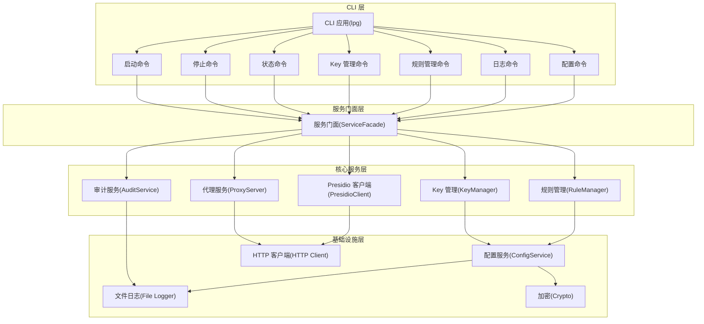
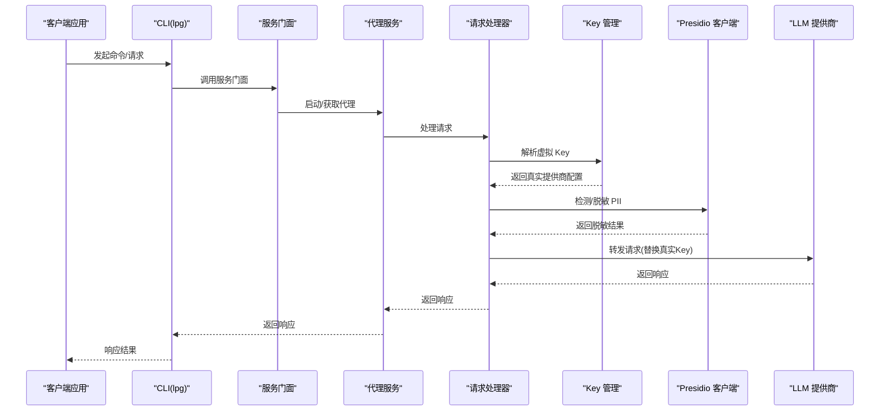
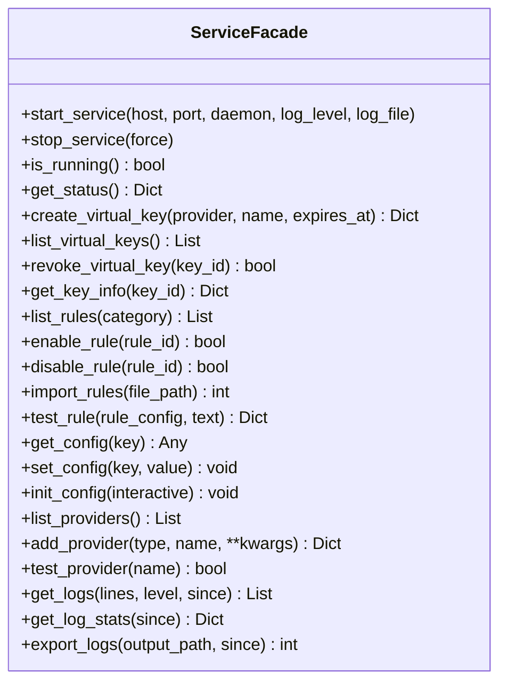
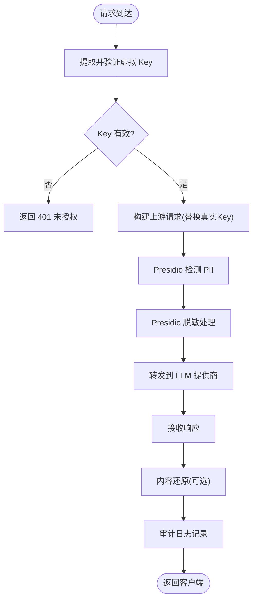
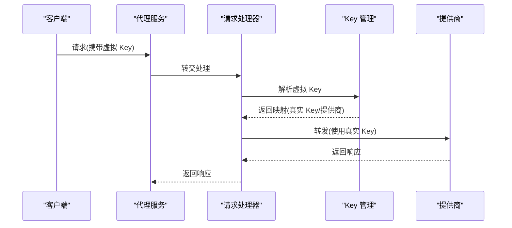
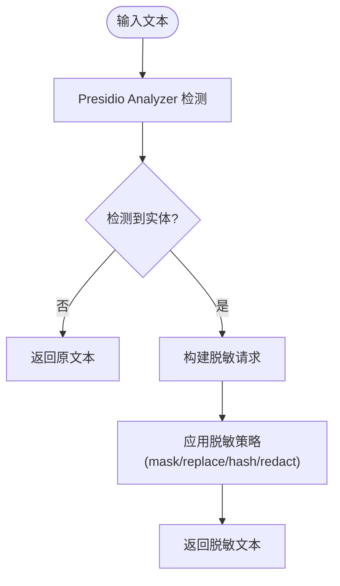
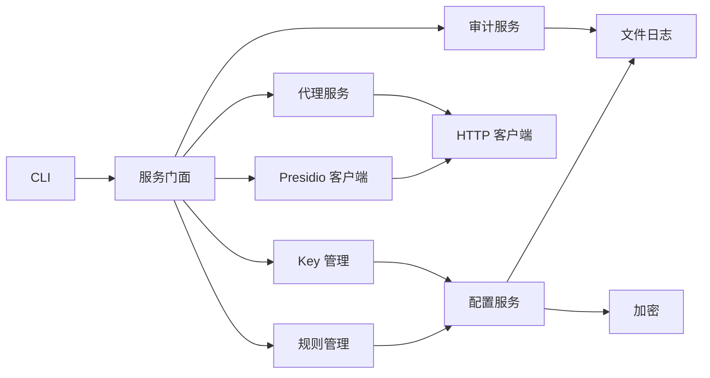

# 项目概述

<cite>
**本文档引用的文件**
- [AGENTS.md](file://AGENTS.md)
- [design-update-20260404-v1.0-init.md](file://doc/design/design-update-20260404-v1.0-init.md)
- [01_cli_commands.md](file://doc/test/tcs/v1.0/01_cli_commands.md)
- [02_proxy_service.md](file://doc/test/tcs/v1.0/02_proxy_service.md)
- [03_key_management.md](file://doc/test/tcs/v1.0/03_key_management.md)
- [04_pii_detection.md](file://doc/test/tcs/v1.0/04_pii_detection.md)
- [05_rule_management.md](file://doc/test/tcs/v1.0/05_rule_management.md)
- [06_audit_logging_testdata.md](file://doc/test/tcs/v1.0/06_audit_logging_testdata.md)
- [07_configuration.md](file://doc/test/tcs/v1.0/07_configuration.md)
</cite>

## 目录
1. [项目简介](#项目简介)
2. [项目结构](#项目结构)
3. [核心组件](#核心组件)
4. [架构总览](#架构总览)
5. [详细组件分析](#详细组件分析)
6. [依赖关系分析](#依赖关系分析)
7. [性能考量](#性能考量)
8. [故障排查指南](#故障排查指南)
9. [结论](#结论)
10. [附录](#附录)

## 项目简介

LLM Privacy Gateway 是一个专注于隐私保护的本地代理与 CLI 工具，旨在请求发送至 LLM 提供商之前，自动检测并脱敏敏感信息（PII）。其核心价值主张包括：

- **本地化与可控性**：所有请求均通过本地代理转发，敏感数据不出站，降低泄露风险。
- **自动化隐私保护**：基于 Presidio 的 PII 检测与脱敏，自动在请求进入 LLM 提供商前完成处理。
- **可运维与可观测**：提供审计日志、状态监控与统计信息，便于合规与运营。
- **可扩展与可配置**：通过配置驱动与规则系统，支持多提供商、多策略的灵活组合。

主要功能特性：
- 虚拟 Key 管理：为不同提供商生成与管理虚拟 Key，实现权限隔离与过期控制。
- PII 检测与脱敏：支持多种实体类型（邮箱、电话、身份证、地址等）的检测与多种脱敏策略（mask、replace、hash、redact）。
- 规则管理：内置与自定义规则，支持按分类与优先级管理。
- 审计日志：记录请求处理全流程，支持查询、统计与导出。
- 配置管理：支持文件、环境变量与命令行参数的多级优先级配置。

## 项目结构

项目采用分层架构与模块化设计，CLI 层负责用户交互，核心服务层承载代理、Key、规则、审计与 Presidio 集成等能力，基础设施层提供配置、日志、HTTP 客户端与加密等支撑。

图表来源
- [design-update-20260404-v1.0-init.md:70-122](file://doc/design/design-update-20260404-v1.0-init.md#L70-L122)
- [design-update-20260404-v1.0-init.md:124-160](file://doc/design/design-update-20260404-v1.0-init.md#L124-L160)

章节来源
- [design-update-20260404-v1.0-init.md:70-160](file://doc/design/design-update-20260404-v1.0-init.md#L70-L160)

## 核心组件

- CLI 应用与命令体系：提供 start/stop/status/config/key/rule/provider/log 等命令，统一通过服务门面访问核心能力。
- 服务门面：封装核心服务实例化与依赖注入，屏蔽服务间耦合，便于扩展。
- 代理服务：基于 aiohttp 的 HTTP 代理，支持 OpenAI API 兼容端点与通用转发，处理请求/响应与流式处理。
- Key 管理：虚拟 Key 的创建、解析、吊销、过期与使用统计，支持权限配置与多提供商映射。
- 规则管理：规则加载、启用/禁用、导入/移除、测试与持久化，支持分类与优先级。
- Presidio 集成：封装 Presidio Analyzer/Anonymizer 的 HTTP 调用，提供检测与脱敏能力。
- 审计服务：记录请求处理全流程，支持查询、统计与导出。
- 配置服务：支持文件、环境变量与命令行参数的多级优先级，提供校验与默认值。

章节来源
- [design-update-20260404-v1.0-init.md:411-568](file://doc/design/design-update-20260404-v1.0-init.md#L411-L568)
- [AGENTS.md:390-415](file://AGENTS.md#L390-L415)

## 架构总览

整体架构采用分层与依赖注入原则，CLI 通过服务门面访问核心服务，核心服务共享配置、审计与 Presidio 客户端等基础设施。请求处理流程贯穿 Key 解析、PII 检测/脱敏、转发与审计记录。

图表来源
- [design-update-20260404-v1.0-init.md:162-250](file://doc/design/design-update-20260404-v1.0-init.md#L162-L250)

章节来源
- [design-update-20260404-v1.0-init.md:162-250](file://doc/design/design-update-20260404-v1.0-init.md#L162-L250)

## 详细组件分析

### CLI 与服务门面

- CLI 层基于 Click 定义命令组，统一注入 ServiceFacade，支持版本、配置路径、输出格式等全局选项。
- 服务门面负责实例化与聚合核心服务（代理、Key、规则、审计、Presidio），并提供统一 API，便于后续扩展。

图表来源
- [design-update-20260404-v1.0-init.md:411-568](file://doc/design/design-update-20260404-v1.0-init.md#L411-L568)

章节来源
- [design-update-20260404-v1.0-init.md:280-311](file://doc/design/design-update-20260404-v1.0-init.md#L280-L311)
- [design-update-20260404-v1.0-init.md:411-568](file://doc/design/design-update-20260404-v1.0-init.md#L411-L568)

### 代理服务与请求处理

- 代理服务基于 aiohttp，支持 OpenAI API 兼容端点与通用转发，提供健康检查与统计信息。
- 请求处理器负责 Key 验证、消息提取、Presidio 检测/脱敏、替换真实 Key、转发上游与响应还原，以及审计记录。

图表来源
- [design-update-20260404-v1.0-init.md:743-784](file://doc/design/design-update-20260404-v1.0-init.md#L743-L784)

章节来源
- [design-update-20260404-v1.0-init.md:570-741](file://doc/design/design-update-20260404-v1.0-init.md#L570-L741)
- [design-update-20260404-v1.0-init.md:743-784](file://doc/design/design-update-20260404-v1.0-init.md#L743-L784)

### Key 管理

- 支持创建带过期时间与权限的虚拟 Key，解析虚拟 Key 映射到真实提供商 Key，支持吊销与统计。
- 与代理服务配合，在请求处理阶段完成 Key 验证与映射。

图表来源
- [design-update-20260404-v1.0-init.md:743-784](file://doc/design/design-update-20260404-v1.0-init.md#L743-L784)

章节来源
- [03_key_management.md:36-125](file://doc/test/tcs/v1.0/03_key_management.md#L36-L125)
- [03_key_management.md:128-202](file://doc/test/tcs/v1.0/03_key_management.md#L128-L202)

### PII 检测与脱敏

- 基于 Presidio 的 Analyzer/Anonymizer，支持多种实体类型与脱敏策略，可配置置信度阈值与实体过滤。
- 支持请求/响应中的 PII 处理，提供流式响应处理能力。

图表来源
- [design-update-20260404-v1.0-init.md:184-216](file://doc/design/design-update-20260404-v1.0-init.md#L184-L216)

章节来源
- [04_pii_detection.md:40-116](file://doc/test/tcs/v1.0/04_pii_detection.md#L40-L116)
- [04_pii_detection.md:209-283](file://doc/test/tcs/v1.0/04_pii_detection.md#L209-L283)

### 规则管理

- 支持内置与自定义规则目录、规则导入/移除、启用/禁用、测试与持久化，支持按分类与优先级管理。
- 规则可与 PII 检测/脱敏策略协同，实现更细粒度的隐私控制。

章节来源
- [05_rule_management.md:39-132](file://doc/test/tcs/v1.0/05_rule_management.md#L39-L132)
- [05_rule_management.md:118-177](file://doc/test/tcs/v1.0/05_rule_management.md#L118-L177)

### 审计日志

- 记录请求处理全流程的关键指标（时间戳、方法、URL、状态码、耗时、PII 检测与脱敏结果等），支持查询、统计与导出。
- 提供结构化日志格式与多种导出格式（JSON/JSONL/CSV 等）。

章节来源
- [06_audit_logging_testdata.md:266-493](file://doc/test/tcs/v1.0/06_audit_logging_testdata.md#L266-L493)

### 配置管理

- 支持配置初始化、加载、读取、设置、验证与持久化，支持环境变量覆盖与命令行参数优先级。
- 提供提供商配置的增删改查与连接测试。

章节来源
- [07_configuration.md:35-113](file://doc/test/tcs/v1.0/07_configuration.md#L35-L113)
- [07_configuration.md:176-250](file://doc/test/tcs/v1.0/07_configuration.md#L176-L250)
- [07_configuration.md:407-451](file://doc/test/tcs/v1.0/07_configuration.md#L407-L451)

## 依赖关系分析

- 依赖注入：服务门面通过构造函数注入各核心服务，避免紧耦合，提升可测试性。
- 异步编程：代理服务与 Presidio 客户端采用异步 I/O，提升并发处理能力。
- 分层解耦：CLI、服务门面、核心服务与基础设施层职责清晰，便于独立演进与替换。

图表来源
- [design-update-20260404-v1.0-init.md:124-160](file://doc/design/design-update-20260404-v1.0-init.md#L124-L160)

章节来源
- [AGENTS.md:390-415](file://AGENTS.md#L390-L415)

## 性能考量

- 异步 I/O：代理与 Presidio 客户端采用异步 HTTP 客户端，减少阻塞，提升吞吐。
- 流式处理：支持 SSE 流式响应，降低内存占用与延迟。
- 超时与重试：可配置上游超时与重试策略，平衡可靠性与性能。
- 统计与监控：内置请求计数、成功率、平均耗时与 PII 检测统计，便于性能观测与优化。

## 故障排查指南

常见问题与定位思路：
- 代理启动失败：检查端口占用、配置文件路径与权限、Presidio 服务连通性。
- Key 无效：确认虚拟 Key 是否存在、是否过期、是否被吊销，检查映射关系。
- PII 检测/脱敏异常：检查 Presidio 服务状态、置信度阈值与实体过滤配置。
- 审计日志缺失：检查日志级别、输出路径与权限、导出格式与查询条件。
- 配置不生效：确认配置优先级（命令行 > 环境变量 > 配置文件），检查格式与默认值。

章节来源
- [02_proxy_service.md:515-544](file://doc/test/tcs/v1.0/02_proxy_service.md#L515-L544)
- [03_key_management.md:144-187](file://doc/test/tcs/v1.0/03_key_management.md#L144-L187)
- [04_pii_detection.md:547-591](file://doc/test/tcs/v1.0/04_pii_detection.md#L547-L591)
- [06_audit_logging_testdata.md:598-633](file://doc/test/tcs/v1.0/06_audit_logging_testdata.md#L598-L633)
- [07_configuration.md:454-498](file://doc/test/tcs/v1.0/07_configuration.md#L454-L498)

## 结论

LLM Privacy Gateway 通过本地代理与 CLI 工具，实现了在请求进入 LLM 提供商之前的自动化隐私保护。其分层架构、依赖注入与异步编程模式，既保证了系统的可维护性与可扩展性，也兼顾了性能与可观测性。结合虚拟 Key 管理、PII 检测/脱敏、规则管理与审计日志，项目为隐私合规提供了完整的技术方案。

## 附录

- 快速开始（概念性指导）
  - 安装与初始化：使用 CLI 初始化配置，设置代理端口与日志级别。
  - 配置提供商：添加 OpenAI/Anthropic 等提供商，填写真实 API Key。
  - 创建虚拟 Key：为不同用途创建带过期时间与权限的虚拟 Key。
  - 启动代理：启动本地代理，验证健康检查端点。
  - 发送请求：使用虚拟 Key 调用 /v1/chat/completions 等端点，观察审计日志与脱敏效果。
  - 规则与日志：导入/启用规则，定期查看日志统计与导出报告。

章节来源
- [01_cli_commands.md:84-143](file://doc/test/tcs/v1.0/01_cli_commands.md#L84-L143)
- [07_configuration.md:37-96](file://doc/test/tcs/v1.0/07_configuration.md#L37-L96)
- [03_key_management.md:36-80](file://doc/test/tcs/v1.0/03_key_management.md#L36-L80)
- [02_proxy_service.md:48-85](file://doc/test/tcs/v1.0/02_proxy_service.md#L48-L85)